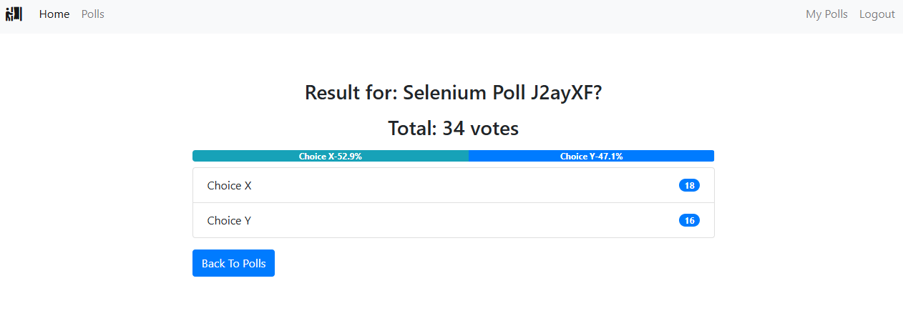
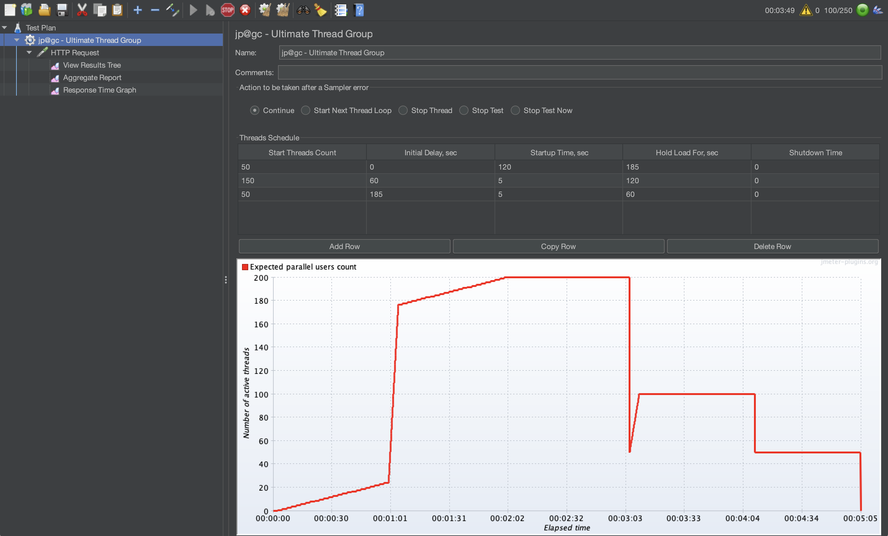

All the work below, an editable version, some appendix are uploaded to: https://github.com/Peterxbh/SQA-FInal-Project

# Task 1:

The Django Poll App is assessed against three major ISO/IEC 25010 quality characteristics: Functional Suitability, Maintainability, and Security.

Functional Suitability measures how well software functions meet user needs. This is a big section with 3 sub criteria and I will try to evaluate each sub criteria (Functional Completeness, Functional Correctness, and Functional Appropriateness). Regarding Functional Completeness, the Poll App successfully implements all described features, including user registration, poll creation, voting, search, and filtering. This is evident in the implementation within polls/views.py, where users can search and filter polls by attributes like name, date, and vote count. All essential user stories, such as preventing double voting and enabling poll owners to manage their polls, are thoroughly covered, achieving a high degree of completeness. Functional Correctness is largely met, as demonstrated by logic within polls/views.py that prevents multiple votes from a single user by checking existing votes before accepting new ones. Furthermore, the system correctly handles poll closures by ceasing to accept votes upon poll termination. Although key functionalities appear robust, additional testing for edge cases like simultaneous votes could further confirm correctness. My user testing below also proves the functional correctness. Functional Appropriateness refers to whether the features serve users in an efficient and comfortable manner, given their context of use and  is also achieved, with user-friendly features such as efficient search and filtering mechanisms found in both views and templates. By displaying only results for ended polls, the app maintains user workflow efficiency. The Poll App’s templates (e.g. `polls/templates/polls/polls_list.html` and `polls/templates/polls/poll_detail.html`) display only “active” polls (via `Poll.objects.all()` and then filtering by activity status in the template’s logic), ensuring a clutter‑free interface.

Maintainability (Modularity, Reusability, Analysability, Modifiability, Testability) assesses how readily software can be adapted or corrected. Modularity means that components (classes, functions, files) have well‑defined responsibilities. And the modularity within the Poll App is robust, notably through its clear separation of concerns into different Django apps (e.g., accounts, polls). Each app is self-contained, minimizing unintended side effects when changes occur in isolated components. Nevertheless, internal modularity could improve by breaking down lengthy functions in polls/views.py into smaller, reusable units, especially for complex tasks like filtering and pagination. Reusability is about how much of the code can be used in other contexts . In the Poll App, reusability is partially realized through template inheritance, which provides consistent layouts across pages. However, opportunities remain for improved reusability, such as abstracting repetitive logic for permission checks into reusable helper functions or decorators. Analysability is how easy it is for a new developer to read and comprehend the code. The Poll App generally uses clear names—e.g. `polls_list`, `polls_add`, `poll_vote`, `user_can_vote`—which aids readability. Models use descriptive field names (`text`, `pub_date`, `active`), and forms are given intuitive names (`PollAddForm`, `ChoiceAddForm`).  Modifiability addresses the effort required to change existing code. For this app, modifiability of the application is fair, with Django's MVC framework supporting straightforward changes like adding new fields to models. However, certain implementation decisions, like manual form processing in views instead of using Django’s built-in forms, could complicate modifications, particularly with input validation changes, thereby raising the potential for unintended defects. Lastly, Testability needs improvement, as the project currently lacks automated tests. While the existing design supports manual testing, tight coupling of logic within views complicates isolated testing. Refactoring business logic from views into model methods or independent services, alongside developing a comprehensive automated test suite, would greatly enhance testability. However, after I finished my project below, the testability could be greatly enhanced. 

Security (Confidentiality, Integrity, Non-repudiation, Authenticity, Accountability) in the Django Poll App addresses important concerns about protecting data and preventing unauthorized actions. Confidentiality is maintained through Django’s authentication system, safeguarding sensitive user data such as passwords through secure hashing. Given the public nature of poll data, confidentiality requirements are inherently simplified and effectively managed. Integrity ensures that data and operations are not altered inappropriately. Integrity is mostly achieved by enforcing stringent permission checks to ensure only authorized users (poll owners) can modify polls, clearly implemented in views like edit_poll and delete_poll. Further strengthening integrity could include database-level constraints to ensure consistency. Non-repudiation ensures that once an action is performed (e.g. casting a vote), the system can prove who did it and cannot have that actor deny it later. It is implicitly addressed through authentication mechanisms linking actions like voting and poll modifications to specific users. However, the absence of explicit audit trails or detailed logging means non-repudiation is minimal, acceptable for simple scenarios but potentially insufficient for high-stakes environments. Accountability ensures that identities are accurately verified—i.e. a user truly is who they claim to be. In the app, accountability is fully realized, with every action traceable to authenticated users through login requirements and user references in poll and vote models. Enhancing accountability through explicit logging of key actions could offer additional assurance. Finally, Authenticity is robustly addressed via Django’s secure authentication practices, ensuring only legitimate users can perform sensitive actions. Although advanced measures like email verification or multi-factor authentication are not implemented, such measures exceed the needs of a basic polling app. Overall, authenticity measures adequately fulfill the application’s security requirements.

 

# Task 2 :

​    1. Linter Configuration

```tex
[MASTER]

load-plugins = pylint_django

ignore = venv

[MESSAGES CONTROL]

enable = W0612, C0301, R1705, C0411, E5142

disable = all #this is done because we want to only see the chosen 5 to be clear

[FORMAT]

max-line-length = 100

[DESIGN]

max-branches = 12

max-locals = 15
```

Error Output before fixing:


I chose one example each and tried to demonstrate the code fixes

------

## 1. `E5142: imported-auth-user`

**Location:** `accounts/forms.py`, line 2

```diff
 from django import forms
 from django.contrib.auth.models import User
```

**Warning:**

```
E5142: User model imported from django.contrib.auth.models (imported-auth-user)
```

**Correction:**
 Use `get_user_model()` so we’re not hard‑coding the `User` import:

```python
from django import forms
from django.contrib.auth import get_user_model

User = get_user_model()
```

Hard‑coding `django.contrib.auth.models.User` breaks if you ever swap in a custom `AUTH_USER_MODEL`, so using `get_user_model()` ensures you always reference the correct user class.

------

## 2. `W0612: unused-variable`

**Location:** `seeder.py`, lines 21–27

```python
     for _ in range(num_entries):
         u = User.objects.create_user(
             first_name=first_name,
             last_name=last_name,
             email=first_name + "." + last_name + "@fakermail.com",
             username=first_name + last_name,
             password="password"
         )
```

**Warning:**

```
W0612: Unused variable 'u' (unused-variable)
```

**Correction:**
 Since we don’t need to reference the created user, drop the assignment or prefix it with an underscore:

```diff
-        u = User.objects.create_user(
+        _ = User.objects.create_user(
             first_name=first_name,
             last_name=last_name,
             email=first_name + "." + last_name + "@fakermail.com",
             username=first_name + last_name,
             password="password"
         )
```

*or simply:*

```python
User.objects.create_user(
    first_name=first_name,
    last_name=last_name,
    …
)
```

------

## 3. `C0411: wrong-import-order`

**Location:** `seeder.py`, lines 1–6

```python
from polls.models import Choice, Poll, Vote
from django.contrib.auth.models import User
import datetime
import random
import time
from faker import Faker
```

**Warning:**

```
C0411: third party import "django.contrib.auth.models.User" should be placed before first party import "polls.models.Choice"  (wrong-import-order)
… (and similar for the other imports)
```

**Correction:**
 Reorder imports into Standard → Third‑party → Django → Local:

```python
import datetime
import random
import time

from faker import Faker

from django.contrib.auth import get_user_model
User = get_user_model()

from polls.models import Choice, Poll, Vote
```

------

## 4. `C0301: line-too-long`

**Location:** `polls/views.py`, line 72 (example)

```python
 messages.success(
     request, "Poll & Choices added successful...", extra_tags='alert alert-success alert-dismissible fade show')
```

**Warning:**

```
C0301: Line too long (128/100)
```

**Correction:**
 Break arguments onto separate lines (or shorten the message):

```diff
	request,
    "Poll & choices added successfully!",
    extra_tags=(
        'alert alert-success '
        'alert-dismissible fade show'
    ),
)
```

------

## 5. `R1705: no-else-return`

**Location:** `accounts/views.py`, lines 56–60

```python
     if check1 or check2 or check3:
         messages.error(
             request, "Registration Failed!", extra_tags='alert alert-warning alert-dismissible fade show')
         return redirect('accounts:register')
     else:
         user = User.objects.create_user(…)
         …
```

**Warning:**

```
R1705: Unnecessary "else" after "return", remove the "else" and de-indent the code inside it (no-else-return)
```

**Correction:**
 Drop the `else:` and de‑indent:

```diff
     if check1 or check2 or check3:
         messages.error(
             request, "Registration Failed!",
             extra_tags='alert alert-warning alert-dismissible fade show'
         )
         return redirect('accounts:register')

-    else:
-        user = User.objects.create_user(…)
-        …
+    user = User.objects.create_user(…)
+    …
```

**Linter Check after fixing the mistakes:**


We can see that after I made all the changes, the score increased significantly from 8.91 to 9.21. I tested the linter each step along the way and have included the linter log in another document named linter_question2.log. In there, I included how fixing each step increases the score and error goes away.

# Task 3

**User Story 1: User Registration**
Story: As an unregistered visitor, I want to create a new account so that I can log in and participate in polls.
**Acceptance Criteria:**
**Given** I am on the registration page and not logged in
**When** I submit a valid username, email, and matching passwords
**Then** my account is created, I am logged in (or directed to login), and I see a success message

 

**User Story 2: User Login**
Story: As a registered user, I want to log in with my credentials so that I can access protected poll features.
**Acceptance Criteria:**
**Given** I have an active account
**When** I enter the correct username and password on the login page
**Then** I am authenticated, redirected to the polls list, and see my username or a “Logout” link

 

**User Story 3: View Poll List (Homepage)**
Story: As a logged in user, I want to see a list of all polls so that I can choose one to view or vote on.
**Acceptance Criteria:**
**Given** I am logged in and polls exist in the system
**When** I navigate to the home page
**Then** I see each poll’s title (and basic info) and pagination controls if needed

 

**User Story 4: Search Polls by Keyword**
Story: As a user, I want to search polls by keyword so that I can quickly find polls of interest.
**Acceptance Criteria:**
**Given** multiple polls exist, some containing the keyword in their titles
**When** I enter a search term and submit
**Then** only polls matching that term are displayed, with pagination preserved

 

**User Story 5: Sort Polls Alphabetically**
Story: As a user, I want to sort polls by title in alphabetical order so that I can quickly find a poll by its name.
**Acceptance Criteria:**
**Given** there are multiple polls with different titles
**When** I select the “Title A → Z” sort option
**Then** the poll list is reordered alphabetically by title (A first, Z last)

 

**User Story 6: Sort Polls by Date**
Story: As a user, I want to sort polls by their creation date so that I can see the newest or oldest polls first.
**Acceptance Criteria:**
**Given** polls exist with varying publish dates
**When** I select “Newest First”
**Then** the list displays polls in descending date order (most recent at top)

 

**User Story 7: Sort Polls by Vote Count**
Story: As a user, I want to sort polls by their total vote count so that I can find the most or least popular polls.
**Acceptance Criteria:**
**Given** polls have different vote totals
**When** I select “Most Voted”
**Then** the list displays polls in descending vote order (highest first)

 

**User Story 8: View Poll Details**
Story: As a user, I want to view a poll’s question and choices so that I can decide whether to vote.
**Acceptance Criteria:**
**Given** I click on a poll title
**When** the detail page loads
**Then** I see the full question, available choices (or results if already voted), and any status indicators

 

**User Story 9: Cast a Vote**
Story: As a user who hasn’t voted, I want to select an option and submit my vote so that my preference is recorded and I can see results.
**Acceptance Criteria:**
**Given** the poll is open and I haven’t voted yet
**When** I choose a choice and click “Vote”
**Then** my vote is saved, I’m shown updated results, and I see a confirmation message

 

**User Story 10: Create a Poll**
Story: As an authenticated user, I want to create a new poll with a question and choices so that others can vote on it.
**Acceptance Criteria:**
**Given** I’m logged in and on the “Create Poll” page
**When** I supply a valid question and at least two choices and submit
**Then** the poll is saved under my account and appears in the poll list with a success notification

 

**User Story 11: Add Choice to a Poll**
Story: As poll owner, I want to add a new choice so that respondents can select from the most relevant options.
**Acceptance Criteria:**
**Given** I am the poll’s creator and on its edit page
**When** I enter text for a new choice and click “Add Choice”
**Then** the new choice appears in the list, the poll is saved, and I see a success confirmation

 

**User Story 12: Remove Choice from a Poll**
Story: As the poll owner, I want to remove an existing choice so that outdated or invalid options are no longer available.
**Acceptance Criteria:**
**Given** I am the poll’s creator, on its edit page, and the poll has at least one removable choice
**When** I click “Delete” next to that choice and confirm
**Then** the choice is removed, the poll is saved without it, and I see a confirmation message

 

**User Story 13: End a Poll**
Story: As the poll owner, I want to close voting on my poll so that no further votes can be cast and results remain final.
**Acceptance Criteria:**
**Given** the poll is open and I’m its owner
**When** I click “End Poll” and confirm
**Then** voting is disabled, the poll is marked as closed, and all users see final results

 

**User Story 14: Delete a Poll**
Story: As the poll owner, I want to delete my poll so that it’s removed from the system.
**Acceptance Criteria:**
**Given** I’m the poll’s creator viewing its detail or edit page
**When** I click “Delete” and confirm
**Then** the poll (and its choices) is removed, I’m redirected to the poll list, and I see a deletion confirmation

 

**User Story 15: View My Polls**
Story: As the poll owner, I want to view a “My Polls” page so that I can see and manage only the polls I’ve created.
**Acceptance Criteria:**
**Given** I am logged in and several polls exist (some I own, some by others)
**When** I navigate to the “My Polls” page
**Then** only polls I created are listed, each linking to its management controls (Edit, End, Delete)

**User Story 16: User Vote**
Story: As a user who has just voted, I want to view the poll’s results so that I can see the outcome of the vote.
**Acceptance Criteria:**
**Given** I am logged in and have submitted my vote on a poll
**When** I navigate to that poll’s detail or results page (either automatically after voting or via the “View Results” link)
**Then**  I see each choice with its vote count (and/or percentage), and no voting form is present

**Test Case 1: Register New User Account**

Test Number: 1

Test Name: Register New User Account

Precondition: Visitor is not logged in and is on the registration page (/accounts/register/)

Input

\- Username: testuser2

\- Email: test2@example.com

\- Password: Password123!

\- Confirm Password: Password123!

Action: Click Register

Date Tested: May 10, 2025

Expected Outcome: The account testuser2 is created, the user is logged in (or redirected to login), and sees “Account created successfully.”

Actual Outcome: Behavior met expected outcome

Result: Pass


**Test Case 2: Login with Valid Credentials**

Test Number: 2

Test Name: Login with Valid Credentials

Precondition: Account testuser1 exists and user is on the login page (/accounts/login/)

Input

\- Username: testuser1

\- Password: Password123!

Action: Click Login

Date Tested: May 10, 2025

Expected Outcome: The user is authenticated, redirected to the polls list, and sees their username or a “Logout” link.

Actual Outcome: Behavior met expected outcome

Result: Pass


This just shows the redirect page

**Test Case 3: Display Poll List**

Test Number: 3

Test Name: Display Poll List

Precondition: User testuser1 is logged in and at least five polls exist in the system

Input

\- Action: Navigate to the http://127.0.0.1:8000/polls/list

Date Tested: May 10, 2025

Expected Outcome: The page displays each poll’s title and basic info, and pagination controls appear

Actual Outcome: Behavior met expected outcome

Result: Pass

 

**Test Case 4: Search Polls by Keyword**

Test Number: 4

Test Name: Search Polls by Keyword

Precondition: User is logged in; polls exist with titles containing “Other”

Input

\- Search Term: Other

Action: Enter term and submit search

Date Tested: May 10, 2025

Expected Outcome: Only polls with “Other” in the title are displayed; pagination remains if matches exceed one page.

Actual Outcome: Behavior met expected outcome

Result: Pass

 

**Test Case 5: Sort Polls Alphabetically**

Test Number: 5

Test Name: Sort Polls Alphabetically

Precondition: User is logged in and polls have varied titles

Input

\- Sort Option: Title A → Z

Action: Select sort option

Date Tested: May 10, 2025

Expected Outcome: Poll list is reordered alphabetically (A first, Z last) and remains so when navigating pages.

Actual Outcome: Behavior met expected outcome

Result: Pass

 

**Test Case 6: Sort Polls by Date (Newest First)**

Test Number: 6

Test Name: Sort Polls by Date

Precondition: User is logged in and polls have varying creation dates

Input

\- Sort Option: Newest First

Action: Select sort option

Date Tested: May 10, 2025

Expected Outcome: Polls are displayed in descending date order.

Actual Outcome: Behavior met expected outcome

Result: Pass

 

**Test Case 7: Sort Polls by Vote Count**

Test Number: 7

Test Name: Sort Polls by Vote Count

Precondition: User is logged in and polls have different vote counts

Input

\- Sort Option: Most Voted

Action: Select sort option

Date Tested: May 10, 2025

Expected Outcome: Polls are displayed in descending order of vote counts (highest first).

Actual Outcome: Behavior met expected outcome

Result: Pass

 

**Test Case 8: Display Poll Detail**

Test Number: 8

Test Name: Display Poll Detail

Precondition: User is logged in; poll ID 1 exists

Input

\- Action: Navigate to http://127.0.0.1:8000/polls/1/

Date Tested: May 10, 2025

Expected Outcome: The poll question and choices (or results) and any status indicators are displayed.

Actual Outcome: Behavior met expected outcome

Result: Pass

 

**Test Case 9: Submit a Vote**

Test Number: 9

Test Name: Submit a Vote

Precondition: User is logged in; poll ID 1 is open; user hasn’t voted yet

Input

\- Selected Choice: Choice X

Action: Click Vote

Date Tested: May 10, 2025

Expected Outcome: The vote is recorded, the user is redirected to the results page.

Actual Outcome: Behavior met expected outcome

Result: Pass

 

**Test Case 10: Create New Poll**

Test Number: 10

Test Name: Create New Poll

Precondition: A Super User is logged in and on the Create Poll page

Action: Login via the main page.

Input:

User Name = rog

Password = 123

Action: Go to my polls and click on the Add button

Poll Input:

\- Question: What’s your favorite season?

\- Choice 1: Summer

\- Choice 2: Winter

Action: Click Add Poll

Date Tested: May 10, 2025

Expected Outcome: The new poll is saved under the user’s account and appears in the poll list with a success notification (Poll & Choices added successfully).

Actual Outcome: Behavior met expected outcome

Result: Pass

 

**Test Case 11: Add Choice to Poll**

Test Number: 11

Test Name: Add Choice to Poll

Precondition: User is poll 1’s owner and on the poll’s edit page on page http://127.0.0.1:8000/polls/edit/1/

Input

\- New Choice: Spring

Action: Click Add

Date Tested: May 10, 2025

Expected Outcome: “Spring” appears in the choice list, the poll is saved, and a success confirmation (Choice added successfully) is shown.

Actual Outcome: Behavior met expected outcome

Result: Pass

 

**Test Case 12: Remove Choice from Poll**

Test Number: 12

Test Name: Remove Choice from Poll

Precondition: User is poll 1’s owner; on the poll’s edit page; choice Spring exists

Input

\- Action: Click Edit next to Spring and then get redirected and click Delete. Say Confirm to the alert.

Date Tested: May 10, 2025

Expected Outcome: Spring is removed from choices, the poll is saved without it, and a confirmation is shown (Choice Deleted successfully).

Actual Outcome: Behavior met expected outcome

Result: Pass

 

**Test Case 13: End Poll**

Test Number: 13

Test Name: End Poll

Precondition: User is poll 1’s owner and poll 1 is open

Input

\- Action: Click End Poll button that looks like an arrow and confirm the alert

Date Tested: May 10, 2025

Expected Outcome: The user is redirected to result page showing the result and poll has been ended.

Actual Outcome: Behavior met expected outcome

Result: Pass

 

**Test Case 14: Delete Poll**

Test Number: 14

Test Name: Delete Poll

Precondition: User is poll 2’s owner and on the poll’s detail or edit page

Input

\- Action: Click edit button that looks like a pencil goes in and then click delete. Confirm the alert. 

Date Tested: May 10, 2025

Expected Outcome: The poll and its choices are removed, user is redirected to the poll list, and sees “Poll deleted Successfully.” message.

Actual Outcome: Behavior met expected outcome

Result: Pass

 

**Test Case 15: View My Polls Page**

Test Number: 15

Test Name: View My Polls Page

Precondition: User is logged in and has created multiple polls

Input

\- Action: Navigate to the My Polls page via the navigation link or go to http://127.0.0.1:8000/polls/list/user/

Date Tested: May 10, 2025

Expected Outcome: Only the user’s own polls are listed; each shows Edit, End, and Delete controls.

Actual Outcome: Behavior met expected outcome

Result: Pass


**Test Case 16: View Poll Results Page**

Test Number: 16

Test Name: View Poll Results Page

Precondition: User is logged in; Poll with ID 1 exists and is open; The user has already voted on Poll 1

Input

\- Action: Automatically directed to the results page after voting

Date Tested: May 10, 2025

Expected Outcome: The page displays each choice alongside its vote count

Actual Outcome: Behavior met expected outcome

Result: Pass


# Task 4

## Unit Test Code

```python
# polls/test_q4_unit.py

from django.test import TestCase, override_settings
from django.core.exceptions import ValidationError
from django.db import IntegrityError
from django.contrib.auth.models import User
from django.utils import timezone

from polls.models import Poll, Choice, Vote
from polls.forms import PollAddForm


@override_settings(PASSWORD_HASHERS=["django.contrib.auth.hashers.MD5PasswordHasher"])
class Q4UnitTestSuite(TestCase):
    def setUp(self):
        self.user = User.objects.create_user("tester", password="pass")
        self.poll = Poll.objects.create(owner=self.user, text="Seed?", pub_date=timezone.now())
        self.choice1 = Choice.objects.create(poll=self.poll, choice_text="A")
        self.choice2 = Choice.objects.create(poll=self.poll, choice_text="B")

    # VALID INPUT

    def test_PollAddForm_valid_data_is_valid(self):
        data = {"text": "Valid?", "choice1": "Yes", "choice2": "No"}
        form = PollAddForm(data)
        self.assertTrue(form.is_valid())

    def test_Poll_get_result_dict_single_choice_all_votes_returns_100_percent(self):
        Vote.objects.create(user=self.user, poll=self.poll, choice=self.choice1)
        results = self.poll.get_result_dict()
        for r in results:
            if r["text"] == "A":
                self.assertEqual(r["percentage"], 100.0)
            else:
                self.assertEqual(r["percentage"], 0.0)
            # ensure alert_class comes from your own list
            self.assertIn(r["alert_class"], [
                "primary","secondary","success",
                "danger","dark","warning","info"
            ])

    #INVALID INPUT

    def test_PollAddForm_missing_choice_fields_is_invalid(self):
        data = {"text": "No Choices"}
        form = PollAddForm(data)
        self.assertFalse(form.is_valid())
        self.assertIn("choice1", form.errors)
        self.assertIn("choice2", form.errors)

    def test_PollAddForm_choice1_below_min_length_is_invalid(self):
        data = {"text": "Q?", "choice1": "", "choice2": "Valid"}
        form = PollAddForm(data)
        self.assertFalse(form.is_valid())
        self.assertIn("choice1", form.errors)

    # BOUNDARY

    def test_Choice_choice_text_at_max_length_is_valid(self):
        max_len = Choice._meta.get_field("choice_text").max_length
        txt = "x" * max_len
        c = Choice(poll=self.poll, choice_text=txt)
        c.full_clean()
        c.save()
        self.assertEqual(Choice.objects.get(pk=c.pk).choice_text, txt)

    def test_PollAddForm_choice1_at_max_length_is_valid(self):
        max_len = PollAddForm.base_fields["choice1"].max_length
        data = {"text": "B?", "choice1": "x" * max_len, "choice2": "Y"}
        form = PollAddForm(data)
        self.assertTrue(form.is_valid())

    # EXCEPTION HANDLING

    def test_Poll_full_clean_blank_text_raises_validation_error(self):
        poll = Poll(owner=self.user, text="", pub_date=timezone.now())
        with self.assertRaises(ValidationError):
            poll.full_clean()

    def test_Choice_create_without_poll_raises_integrity_error(self):
        with self.assertRaises(IntegrityError):
            Choice.objects.create(choice_text="Orphan")

    # BUSINESS LOGIC

    def test_Poll_user_can_vote_after_vote_returns_false(self):
        self.assertTrue(self.poll.user_can_vote(self.user))
        Vote.objects.create(user=self.user, poll=self.poll, choice=self.choice1)
        self.assertFalse(self.poll.user_can_vote(self.user))

    def test_Choice_get_vote_count_reflects_votes(self):
        self.assertEqual(self.choice1.get_vote_count, 0)
        Vote.objects.create(user=self.user, poll=self.poll, choice=self.choice1)
        self.assertEqual(
            Choice.objects.get(pk=self.choice1.pk).get_vote_count,
            1
        )

```

**Test 1:** The test `test_PollAddForm_valid_data_is_valid` checks if the form validation (`PollAddForm.is_valid`) works correctly when the input is good. To do this, I first create a simple form data dictionary with a valid poll question (`"Valid?"`) and two distinct answer choices (`"Yes"` and `"No"`). Then, I call `form.is_valid()` to see if the form accepts this input. I expect the form to return `True`, meaning the validation passes, because this input clearly meets all the form requirements.

**Test 2:** The test `test_Poll_get_result_dict_single_choice_all_votes_returns_100_percent` tests the poll's vote percentage calculation, specifically when one choice gets all the votes. First, I create exactly one vote for choice `"A"` and none for choice `"B"`. Then, I call `poll.get_result_dict()` to calculate the results. I expect choice `"A"` to have `100%` of the votes and choice `"B"` to have `0%`. Also, I make sure the result includes a valid CSS class for display, from the allowed classes like `"primary"`, `"secondary"`, etc.

**Test 3:** The test `test_PollAddForm_missing_choice_fields_is_invalid` checks whether the form correctly handles missing choices. I intentionally leave out both `"choice1"` and `"choice2"` from the form data and only provide a poll question `"No Choices"`. Then, I call `form.is_valid()`. I expect the form validation to fail (`False`), and specifically expect errors pointing out the missing `"choice1"` and `"choice2"` fields, since they are required.

**Test 4:** In the test `test_PollAddForm_choice1_below_min_length_is_invalid`, I’m checking the form's minimum length constraint on `"choice1"`. I set `"choice1"` as an empty string (`""`) while providing valid inputs for `"text"` and `"choice2"`. Then, I validate the form. The expected outcome is that the form returns `False` due to the empty `"choice1"` not meeting the `min_length=1` requirement. I also confirm specifically that `"choice1"` appears in the errors list.

**Test 5:** In `test_Choice_choice_text_at_max_length_is_valid`, I test the boundary condition for the `Choice.choice_text` field, which has a maximum length of 255 characters. I create a string that’s exactly 255 characters long, and then try to save it as a new choice after calling `full_clean()` for validation. I expect this to pass validation and save correctly, meaning the database should store the choice text exactly as given.

**Test 6:** The test `test_PollAddForm_choice1_at_max_length_is_valid` checks the maximum length limit on `"choice1"` in the poll creation form, which has a max length of 100 characters. I create form data with `"choice1"` exactly 100 characters long. Then, I call the form's validation method. The expected result is that validation succeeds (`True`), because the input exactly matches the boundary defined in my form.

**Test 7:** In `test_Poll_full_clean_blank_text_raises_validation_error`, I test whether the model correctly handles empty poll questions. I set up a new `Poll` instance with an empty string for the text field. When calling `full_clean()`, I expect it to raise a `ValidationError`, since empty poll questions are not allowed by our validation rules.

**Test 8:** The test `test_Choice_create_without_poll_raises_integrity_error` makes sure that database integrity constraints are properly enforced. I attempt to create a new `Choice` without associating it to any `Poll`. I expect the database to raise an `IntegrityError` due to the foreign key constraint, ensuring orphan choices cannot exist.

**Test 9:** With `test_Poll_user_can_vote_after_vote_returns_false`, I’m verifying my custom business logic in `Poll.user_can_vote(user)`. I first confirm the user is initially allowed to vote (`True`). Then, I simulate the user casting a vote, and call the same method again. This time, I expect it to return `False`, confirming the logic correctly prevents the same user from voting more than once in the same poll.

**Test 10:** The last test, `test_Choice_get_vote_count_reflects_votes`, tests if the `Choice.get_vote_count` correctly reflects the number of votes. Initially, I verify the vote count for `"choice1"` is zero. Then, I create a new vote for this choice. After saving, I fetch the choice again and expect the vote count to have updated from `0` to `1`. This confirms that vote-count logic correctly tracks actual votes.


#### Coverage Report


Overall, the project has a total of 621 executable statements. By running only the ten unit tests from my test_q4_unit.py file, I was able to cover 261 of these statements, achieving approximately 42% overall statement coverage.

In terms of what these unit tests effectively cover, the file polls/forms.py has complete coverage (100%). My tests thoroughly exercised the PollAddForm's validation logic, specifically the field trimming, minimum and maximum length validations, and required-field checks. Likewise, polls/models.py achieved 94% coverage, particularly focusing on critical methods such as user_can_vote, get_result_dict, and get_vote_count. Additionally, boundary conditions, such as the maximum length constraint on Choice.choice_text, were also extensively tested. Files like polls/admin.py, polls/urls.py, as well as apps.py and migration files within the polls app, reached 100% coverage simply through import statements, as these files contain minimal or automatically generated logic. The same is true for the admin, apps, forms, URLs, and migration files within the accounts app.

However, several areas of the project still have significant gaps in coverage. Notably, polls/views.py stands at only 20% coverage, leaving most of the view-related logic—including displaying polls, poll details, voting, and result pages—untested. Similarly, accounts/views.py has minimal coverage at just 19%, meaning key functionalities such as user login/logout and profile management haven't been covered by these unit tests. Moreover, other modules like polls/tests.py, test_poll_e2e.py, seeder.py, and pollme/wsgi.py were not executed by these tests, resulting in 0% coverage for each of these modules. This lack of coverage primarily stems from the deliberate focus on my specific set of ten unit tests for this assignment, which excluded integration, end-to-end, and data-seeding tests.

# Task 5

## **StubRequestVoteChoiceTest**

### Production snippet (`polls/views.py`)

```python
@login_required
def poll_vote(request, poll_id):
    poll = get_object_or_404(Poll, pk=poll_id)

    if not poll.user_can_vote(request.user):
        messages.error(request, "You already voted…")
        return redirect("polls:list")

    choice_id = request.POST.get("choice")# external dependency #as it depends on request
    if choice_id:
        choice = Choice.objects.get(id=choice_id)
        Vote.objects.create(user=request.user, poll=poll, choice=choice)
        return render(request, "polls/poll_result.html", {"poll": poll})

    messages.error(request, "No choice selected!")
    return redirect("polls:detail", poll_id=poll.id)
```

### Stub implementation

We replace the heavy `HttpRequest` object with a **StubRequest** that exposes just the
 attributes the view reads.

```python
# tests/stubs.py
from types import SimpleNamespace

def make_stub_request(user, post_dict):
    """Return a minimal stand-in for django.http.HttpRequest."""
    return SimpleNamespace(
        method="POST",
        POST=post_dict,
        user=user,
        _messages=None,
    )
```

### Test case

```python
# tests/test_vote_stub_request.py
from django.test import TestCase, override_settings
from django.utils import timezone
from django.contrib.auth.models import User

from polls.models import Poll, Choice, Vote
from polls.views import poll_vote
from tests.stubs import make_stub_request  # stub factory, when i did those, i made it a new directory in the folder and added __init__. Only this set up will allow me to run this test. It just means set up a folder called test and add an init file, then put this file and stub into that place.


@override_settings(PASSWORD_HASHERS=['django.contrib.auth.hashers.MD5PasswordHasher'])
class StubRequestVoteChoiceTest(TestCase):
    def setUp(self):
        self.owner = User.objects.create_user("owner")
        self.voter = User.objects.create_user("voter")
        self.poll  = Poll.objects.create(text="Rainy Day?", owner=self.owner,
                                         pub_date=timezone.now())
        self.choice = Choice.objects.create(poll=self.poll, choice_text="Umbrella")

        # Ensure user_can_vote() returns True so we stay in the branch we want. This is not a key replacement and likely not helpful isolation. But in my case, I am just trying to test the happy path. So this should be set to true.
        self.poll.user_can_vote = lambda _u: True   # one-line stub for model method

    def test_vote_success_with_stub_request(self):
        stub_req = make_stub_request(self.voter, {"choice": str(self.choice.id)})

        response = poll_vote(stub_req, self.poll.id)

        # response should be the rendered results page
        self.assertEqual(response.status_code, 200)

        # the vote should be persisted
        self.assertTrue(
            Vote.objects.filter(user=self.voter,
                                 poll=self.poll,
                                 choice=self.choice).exists()
        )
```

| **Double type** | **What it replaces**                             | **Why that replacement is useful**                           | **How it isolates the code under test**                      |
| --------------- | ------------------------------------------------ | ------------------------------------------------------------ | ------------------------------------------------------------ |
| **Stub**        | `HttpRequest` object (`django.http.HttpRequest`) | Lets us call the view as a plain function with no middleware, session, or test-client overhead. So, we don't have to have Django running and access database in order to test the vote logic and if it parses the request object correctly. | Removes the entire request/response stack; we control exactly the attributes the view touches, keeping the test tiny and fast. |

### Screenshot of Execution


## **MockVoteSaveTest**

### Production snippet (`polls/views.py`)

```python
@login_required
def poll_vote(request, poll_id):
    poll = get_object_or_404(Poll, pk=poll_id)

    if not poll.user_can_vote(request.user):
        messages.error(request, "You already voted…")
        return redirect("polls:list")

    choice_id = request.POST.get("choice")  # external dependency: request.POST
    if choice_id:
        choice = Choice.objects.get(id=choice_id)    # ORM lookup
        vote = Vote(user=request.user, poll=poll, choice=choice)
        vote.save()                                  # persistence side‑effect
        return render(request, "polls/poll_result.html", {"poll": poll})

    messages.error(request, "No choice selected!")
    return redirect("polls:detail", poll_id=poll.id)
```

### Mock implementation

We intercept the call to `Vote.save()` so it never actually writes to the database, but instead records how many times (and with what arguments) it was invoked.

```python
# We’ll use unittest.mock.patch to replace Vote.save with a Mock:
from unittest.mock import patch
```

### Test case

```python
# polls/tests/test_vote_mock_save.py
from unittest.mock import patch
from django.test import TestCase
from django.utils import timezone
from django.urls import reverse
from django.contrib.auth.models import User

from polls.models import Poll, Choice
from polls.views import poll_vote

@patch('polls.views.Vote.save')
class MockVoteSaveTest(TestCase):
    def setUp(self):
        self.user   = User.objects.create_user('u2', 'u2@example.com', 'pass')
        self.poll   = Poll.objects.create(
            text='Another Q?',
            owner=self.user,
            pub_date=timezone.now()
        )
        self.choice = Choice.objects.create(
            poll=self.poll,
            choice_text='No'
        )
        self.client.login(username='u2', password='pass')

    def test_vote_calls_save(self, mock_save):
        """
        Mock: intercept Vote.save() to verify the view calls it exactly once.
        """
        response = self.client.post(
            reverse('polls:vote', args=(self.poll.id,)),
            {'choice': self.choice.id}
        )

        # Should render results (HTTP 200)
        self.assertEqual(response.status_code, 200)

        # Ensure Vote.save() was called exactly once
        mock_save.assert_called_once()
```

| **Double type** | **What it replaces**             | **Why that replacement is useful**                           | **How it isolates the code under test**                      |
| --------------- | -------------------------------- | ------------------------------------------------------------ | ------------------------------------------------------------ |
| **Mock**        | `Vote.save()` persistence method | Prevents real database writes and lets us verify *that* save() was invoked, not *what* it does. | By swapping out `save()` with a `Mock`, we isolate the view logic from the ORM’s write side‑effects and focus the test solely on the interaction with `save()`. |

### Screenshot of Execution


## **FakeVoteDoubleSubmitTest**

### Production snippet (`polls/views.py`)

```python
@login_required
def poll_vote(request, poll_id):
    poll = get_object_or_404(Poll, pk=poll_id)

    # Prevent duplicate voting
    if Vote.objects.filter(poll=poll, user=request.user).exists():
        messages.error(request, "You already voted this poll!")
        return redirect("polls:list")

    choice_id = request.POST.get("choice")
    if choice_id:
        choice = Choice.objects.get(id=choice_id)
        Vote.objects.create(user=request.user, poll=poll, choice=choice)
        return render(request, "polls/poll_result.html", {"poll": poll})

    messages.error(request, "No choice selected!")
    return redirect("polls:detail", poll_id=poll.id)
```

### Fake implementation

```python
class FakeVoteManager:
    def __init__(self):
        self.votes = []
        self._exists_flag = False

    def filter(self, **kwargs):
        poll = kwargs.get("poll")
        user = kwargs.get("user")
        self._exists_flag = any(
            v["poll"] == poll and v["user"] == user
            for v in self.votes
        )
        return self

    def exists(self):
        return self._exists_flag

    def create(self, **kwargs):
        self.votes.append(kwargs.copy())
        return kwargs
```

The `FakeVoteManager` is an in‑memory stand‑in for Django’s `Vote.objects` manager: it records votes in a simple list, implements the same `filter(...).exists()` and `create(...)` interface, and uses an internal flag to simulate whether a given `(poll, user)` pair has already been recorded.

### Test case

```python
# polls/tests/test_vote_fake_request.py

from django.test import TestCase, override_settings
from django.utils import timezone
from django.contrib.auth.models import User
from polls.models import Poll, Choice, Vote
from polls.tests.fakes import FakeVoteManager

@override_settings(PASSWORD_HASHERS=['django.contrib.auth.hashers.MD5PasswordHasher'])
class FakeVoteDoubleSubmitTest(TestCase):
    def setUp(self):
        self.owner = User.objects.create_user("owner", password="pass")
        self.voter = User.objects.create_user("voter", password="pass")
        self.poll = Poll.objects.create(
            text="In‑memory Fake Vote?",
            owner=self.owner,
            pub_date=timezone.now()
        )
        self.choice = Choice.objects.create(
            poll=self.poll,
            choice_text="Option A"
        )

        # 2) Patch the manager in views to use fake manager
        import polls.views as views
        self.fake_mgr = FakeVoteManager()
        views.Vote.objects = self.fake_mgr
        self._views = views

        def fake_user_can_vote(this_poll, user):
            fm = self.fake_mgr.filter(poll=this_poll, user=user)
            return not fm.exists()

        views.Poll.user_can_vote = fake_user_can_vote

        def fake_save(self, *args, **kwargs):
            self.__class__.objects.create(
                poll=self.poll,
                user=self.user,
                choice=self.choice
            )

        views.Vote.save = fake_save

    def test_prevent_second_vote_success(self):
        self.client.login(username="voter", password="pass")

        self.client.post(
            f"/polls/{self.poll.id}/vote/",
            {"choice": self.choice.id},
            follow=True
        )
        self.client.post(
            f"/polls/{self.poll.id}/vote/",
            {"choice": self.choice.id},
            follow=True
        )

        recorded = [
            v for v in self.fake_mgr.votes
            if v["poll"] == self.poll and v["user"] == self.voter
        ]
        self.assertEqual(
            len(recorded), 1,
            "after two vote, we are expecting one vote because of vote prevention."
        )
```

In `test_first_and_second_vote`, we simulate two POST requests to the `poll_vote` view. The **first** request should create a vote (so `fake_mgr.votes` grows to length 1), and the **second** should be blocked by the `filter(...).exists()` check (so `fake_mgr.votes` remains at length 1). This verifies that the view’s “no double voting” logic works correctly. But, note how we are testing with two votes. Likely this test will be paired with another one so we know if vote one will be successful first (I know it works because I tested my function). But due to the limit of the question which only asks for one, I am leaving that other test out. 

| **Double Type** | **What it Replaces**                | **Why that replacement is useful**                           | **How it Isolates**                                          |
| --------------- | ----------------------------------- | ------------------------------------------------------------ | ------------------------------------------------------------ |
| **Fake**        | `Vote.objects` manager (DB queries) | Stores vote records in a simple in‑memory list instead of hitting the real database. It implements both `filter(...).exists()` and `create(...)`, allowing us to test “first vote vs. duplicate vote” logic without any real I/O. Without this, it is hard to test the prevent double voting logic that we had before. This implementation allows us to test if poll vote correctly guards users from double voting. | Completely removes database dependencies. We can simulate “has user already voted?” and “create vote” entirely in memory. |

### Screenshot of Execution


# Task 6

I only tested homepage as discussed

## Load Test:


- Purpose: Evaluate System Performance under normal load
- Users: 50 virtual users
- Ramp-Up: 120 seconds
- Duration: 300 seconds (5 minutes)
- Endpoints Tested:
  - `GET ` – Home Page

**Home Page Load Test:**


### Spike Test

#### Ultimate Thread Group



- Purpose: Evaluate system behavior during a sudden traffic surge.
- Users:
  - Start with 50 users for 120 second ramp up which is my load test, after reaching this load test profile we spike more
  - Spike 150 more users in 5 seconds
  - Hold high load for 2 minutes
  - Drop back and then add 50 users back in to see that it is still functioning (this is a not completely necessary but added to ensure cooldown process)
- Initial Delay: 60 seconds before spike
- Endpoints Tested:
  - `GET /` – Home Page


It is quite interesting to see how this app fails so horribly under spike test. But, since I only deployed it locally, this could just be due to the limitation of my pc.

### Endurance Test


- Purpose: Evaluate System Performance Over a Long Period of time
- Users: 50 virtual users
- Ramp-Up: 120 seconds
- Duration: 1 hour (3600 seconds)
- Endpoints Tested:
  - `GET /` – Home Page


The error rate is much higher in endurance test than the load test. Meaning the app is not very good if running a long load for quite some time. But again, this could've just been due to my computer's server holding capability.

# Task 7

```python
import unittest
import random
import string
from selenium import webdriver
from selenium.webdriver.chrome.service import Service
from selenium.webdriver.common.by import By
from selenium.webdriver.support.ui import WebDriverWait
from selenium.webdriver.support import expected_conditions as EC
from selenium.webdriver.chrome.options import Options
from selenium.common.exceptions import TimeoutException

CHROME_DRIVER_PATH = r"C:\Users\ROG\Downloads\chromedriver-win64\chromedriver-win64\chromedriver.exe"
BASE_URL = "http://127.0.0.1:8000"
SUPERUSER = {'username': 'rog', 'password': '123'}

class PollAppEndToEnd(unittest.TestCase):
    @classmethod
    def setUpClass(cls):
        options = Options()
        options.add_experimental_option("excludeSwitches", ["enable-logging"])
        cls.driver = webdriver.Chrome(service=Service(CHROME_DRIVER_PATH), options=options)
        cls.wait = WebDriverWait(cls.driver, 10)
        cls.driver.maximize_window()

    @classmethod
    def tearDownClass(cls):
        cls.driver.quit()

    def login(self, user):
        self.driver.get(f"{BASE_URL}/accounts/login/")
        self.wait.until(EC.visibility_of_element_located((By.NAME, "username"))).send_keys(user['username'])
        self.driver.find_element(By.NAME, "password").send_keys(user['password'])
        self.driver.find_element(By.XPATH, "//button[@type='submit']").click()
        self.wait.until(EC.element_to_be_clickable((By.LINK_TEXT, "Logout")))

    def logout(self):
        self.driver.find_element(By.LINK_TEXT, "Logout").click()
        self.wait.until(EC.element_to_be_clickable((By.LINK_TEXT, "Login")))

    def test_01_admin_creates_poll(self):
        self.login(SUPERUSER)
        suffix = ''.join(random.choices(string.ascii_letters + string.digits, k=6))
        poll = {'question': f"Selenium Poll {suffix}?", 'choices': ["Choice X", "Choice Y"]}
        type(self).poll = poll
        self.driver.get(f"{BASE_URL}/polls/add/")
        self.wait.until(EC.visibility_of_element_located((By.NAME, "text"))).send_keys(poll['question'])
        for idx, choice in enumerate(poll['choices'], start=1):
            self.driver.find_element(By.NAME, f"choice{idx}").send_keys(choice)
        self.driver.find_element(By.XPATH, "//button[@type='submit']").click()

        self.driver.get(f"{BASE_URL}/polls/list/")
        self.wait.until(EC.element_to_be_clickable((By.LINK_TEXT, "Last"))).click()
        link = self.wait.until(EC.element_to_be_clickable((By.LINK_TEXT, poll['question'])))
        type(self).poll_url = link.get_attribute("href")
        type(self).viewer = None

        self.logout()

    def test_02_user_registers_and_logs_in(self):
        new_user = {
            'username': f"user_{random.randint(10000,99999)}",
            'password': 'Pass!' + ''.join(random.choices(string.ascii_letters, k=5))
        }
        type(self).viewer = new_user

        self.driver.get(f"{BASE_URL}/accounts/register/")
        self.wait.until(EC.visibility_of_element_located((By.NAME, "username"))).send_keys(new_user['username'])
        self.driver.find_element(By.NAME, "email").send_keys(f"{new_user['username']}@example.com")
        self.driver.find_element(By.NAME, "password1").send_keys(new_user['password'])
        self.driver.find_element(By.NAME, "password2").send_keys(new_user['password'])
        self.driver.find_element(By.XPATH, "//button[@type='submit']").click()
        success = self.wait.until(EC.visibility_of_element_located((By.CLASS_NAME, "alert-success"))).text
        self.assertIn("Thanks for registering", success)

        self.login(new_user)

    def test_03_vote_and_check_results(self):
        self.driver.get(self.poll_url)
        self.wait.until(EC.element_to_be_clickable((By.ID, "choice1"))).click()
        self.driver.find_element(By.XPATH, "//input[@value='Vote']").click()
        badge = self.wait.until(EC.visibility_of_element_located(
            (By.CSS_SELECTOR, "ul.list-group li span.badge-pill")
        )).text
        self.assertEqual(badge, "1")
        
    def test_04_admin_edits_choice(self):
        self.logout()
        self.login(SUPERUSER)
        poll_id = self.poll_url.rstrip("/").split("/")[-1]
        self.driver.get(f"{BASE_URL}/polls/edit/{poll_id}/")
        self.wait.until(EC.element_to_be_clickable(
            (By.CSS_SELECTOR, ".choices ul li:first-child a"))
        ).click()
        field = self.wait.until(EC.visibility_of_element_located((By.NAME, "choice_text")))
        new_text = field.get_attribute("value") + " (edited)"
        field.clear()
        field.send_keys(new_text)
        self.driver.find_element(By.XPATH, "//button[@type='submit']").click()
        self.driver.get(f"{BASE_URL}/polls/edit/{poll_id}/")
        first_choice_text = self.wait.until(EC.visibility_of_element_located(
            (By.CSS_SELECTOR, ".choices ul li:first-child")
        )).text
        self.assertIn("(edited)", first_choice_text)

    def test_05_admin_ends_poll(self):
        self.login(SUPERUSER)
        self.driver.get(f"{BASE_URL}/polls/list/user/")
        pages = self.driver.find_elements(By.LINK_TEXT, "Last")
        if pages:
            pages[0].click()
        li = self.wait.until(EC.visibility_of_element_located((By.XPATH,
            f"//li[contains(normalize-space(), '{self.poll['question']}')]")
        ))
        end_anchor = li.find_element(By.XPATH, ".//a[contains(@href, '/polls/end/')]")
        self.driver.execute_script("arguments[0].click();", end_anchor)
        self.wait.until(EC.alert_is_present())
        self.driver.switch_to.alert.accept()
        heading = self.wait.until(EC.visibility_of_element_located((By.TAG_NAME, "h3"))).text
        self.assertIn("Has Ended Polling", heading)


if __name__ == "__main__":
    unittest.main(verbosity=2)

```

My end‑to‑end test suite begins by logging in as the superuser and creating a new poll with two choices, verifying that the poll appears correctly in the list view. Next, we register a fresh viewer account, confirm the registration success message, and log in as that user to ensure that a non‑owner can access the poll. In the third step, we navigate to the poll page as the viewer, cast a vote on the first choice, and assert that the vote count badge updates to “1.” Then we switch back to the superuser, edit the text of the first choice, save the changes, and reload the edit page to confirm that the modification persists. Finally, still logged in as the superuser, we locate our poll in the “My Polls” list, click the End action, accept the confirmation alert, and verify that the poll’s heading reflects the “Has Ended Polling” state.

All of them stay in the same class, because I wish to have them access the same poll that we created in task1.


# Task 8

### Testing Objectives

The primary objective of this Smoke Test Plan is to verify the critical functionality of the Django Poll App at a high level to ensure that major features work as intended after each new deployment or update. Smoke testing will focus on the core user journeys and essential features of the application without diving into exhaustive detail. It aims to quickly detect showstopper issues in:

- User authentication and basic navigation.
- Poll creation and management by poll owners.
- Voting process and result viewing for end-users.
- Search and filtering capabilities on polls.
- Authorization rules (ensuring only allowed actions are possible for each user role).

By executing this smoke test suite, we ensure that the application’s most important functions (such as logging in, creating a poll, voting, etc.) are intact. If any smoke test fails, the build will be considered unstable, and further testing will be halted until the issues are resolved.

### Scope and Coverage

#### In Scope

The smoke tests will cover all major features of the Django Poll App that are critical for basic operation:

- **User Registration and Login:** Verifying that new users can sign up and existing users can log in, as these are prerequisites for accessing polls.
- **Poll Listing and Detail View:** Ensuring that authenticated users can view the list of polls and see poll details (questions and choices).
- **Voting Process:** Checking that a user can cast a vote on a poll, and that the vote is counted and recorded correctly (including displaying updated results).
- **Vote Restrictions:** Ensuring that users cannot vote more than once on the same poll (one vote per user) and that once a poll is closed (ended by its owner), no further votes can be cast.
- **Poll Management (Owner actions):** Verifying that a poll owner can create a new poll, add choices, edit the poll or choices, delete them, and end/close the poll. Also, confirming that non-owners are prevented from accessing these management functions.
- **Search and Filter:** Testing the search functionality (by poll question or title) and filtering options (by poll name keyword, publish date, or number of votes) on the poll list. This includes ensuring that pagination works correctly in combination with filters (e.g., filters remain applied when navigating to the next page of results).
- **Navigation and Links:** Basic navigation such as accessing the home page, navigating to polls section, and using provided links (e.g., to create a poll or to vote) will be checked to ensure they lead to the correct pages.
- **Performance and Load Testing:** We will be using JMeter to conduct, endurance test, spike test, and load test on the homepage to ensure homepage's performance. 

#### Out of Scope

The smoke test is not intended to cover every edge case and the following are out of scope:

- **Comprehensive Form Validation:** Detailed validation of every form field (e.g., testing all invalid input types for each field) is left for full functional testing. Smoke tests will only cover typical valid inputs and one-off obvious invalid case if critical.
- **UI/UX Details on Different Browsers:** Cross-browser compatibility and detailed UI layout checks are not included in smoke testing. We assume basic UI is acceptable if functionality works; detailed rendering issues would be handled in a separate UI test or during user acceptance.
- **Database Migrations and Data Integrity Checks:** The smoke test will run on a pre-set test environment. It will not cover testing of database migration scripts or backup/restore processes. These are handled separately during deployment testing.
- **Non-critical Features:** Any minor or informational features (such as viewing user profile) are not included in smoke scope unless they are directly tied to the core poll functionality.

### Testing Approach

We will employ a hybrid approach combining manual testing with automated testing. The approach leverages existing Selenium scripts for end-to-end automation of key scenarios, the already established JMeter for performance tests, while also relying on manual testing for certain checks that are quicker to verify by inspection or not yet automated.

#### Manual Testing

Manual testing will be used for scenarios where human observation is valuable or automation is not yet available. This includes the test cases from question 3.

#### Automated Testing (Selenium and JMeter)

Automated smoke tests using Selenium WebDriver will cover the critical end-to-end user flows in a web browser, ensuring that the UI and backend work together correctly. These scripts will be run on the test environment to quickly validate core functionalities such as:

- Logging into the application with valid credentials.
- Creating a new poll (including adding poll question and choices via the web UI).
- Voting on a poll and viewing the updated results.
- Ensuring that a user cannot vote twice (the script might try to vote again and verify an error or that the vote count did not change).

We will also use JMeter for performance tests on endurance, load, and spike testing.

### Test Scenarios and Cases

Below is a list of 13 key user scenarios for the Poll App, along with their corresponding test cases. Each user story is a high-level scenario representing something a user needs to do, and the test case describes how we will verify it. We also indicate whether each test will be executed manually or with Selenium automation (test type). These scenarios are derived from the application's feature set and the testing strategy provided:

Below is the same list of 13 key user scenarios, each annotated with Test Type and which Selenium test (or manual test case) covers it:

1. **User Story:** *As a visitor, I want to register an account so that I can log in and participate in polls.*
   - **Test Type:** Automated (Selenium) – covered by `test_02_user_registers_and_logs_in`.
2. **User Story:** *As a registered user, I want to log in so that I can access the polls functionality.*
   - **Test Type:** Automated (Selenium) – also covered by `test_02_user_registers_and_logs_in`.
3. **User Story:** *As an authenticated user, I want to view a list of available polls so that I can choose one to vote on.*
   - **Test Type:** Manual -  Test Case 3 of Question 3 covers this.
4. **User Story:** *As an authenticated user, I want to view poll details (question and choices) so that I can decide how to vote.*
   - **Test Type:** Manual -  Test Case 7 of Question 3 covers this.
5. **User Story:** *As a user, I want to vote on a poll of my choice so that my opinion is counted.*
   - **Test Type:** Automated (Selenium) – covered by `test_03_vote_and_check_results`.
6. **User Story:** *As the owner of a poll, I want to create a new poll with multiple choices so that users can vote on it.*
   - **Test Type:** Automated (Selenium) – covered by `test_01_admin_creates_poll`.
7. **User Story:** *As the owner of a poll, I want to edit the poll (or its choices) so that I can correct mistakes or update information.*
   - **Test Type:** Automated (Selenium) – covered by `test_05_admin_edits_choice`.
8. **User Story:** *As the owner of a poll, I want to end (close) the poll when it's done so that no further votes can be cast and the final results are shown to users.*
   - **Test Type:** Automated (Selenium) – covered by `test_04_admin_ends_poll`.
9. **User Story:** *As any user, I want to view the results of a poll (total votes for each choice) so that I can see the outcome.*
   - **Test Type:** Manual -  Test Case 16 of Question 3 covers this.
10. **User Story:** *As a user, I want to filter the list of polls by publish date so that I can see polls created on a specific date or range.*
    - **Test Type:** Manual – Test Case 13 of Question 3 covers this.
11. **User Story:** *As a user, I want to filter or sort polls by the number of votes so that I can find the most popular or least popular polls easily.*
    - **Test Type:** Manual – Test Case 7 of Question 3 covers this.
12. **User Story:** *As a user, I want pagination to work correctly with filters/search so that I can navigate through all results.*
    - **Test Type:** Manual – Test Case 15 of Question 3 covers this.
13. **User Story:** *As a user, I want to search for a poll by keyword so that I can find a specific poll easily.*
    - **Test Type:** Manual - Test Case 4 of Question 3 covers this.

Besides those, we will also conduct the endurance, spike, and load test from question 6 just for some performance metrics.

### Test Deliverables

The following deliverables will result from the smoke testing process:

- **Smoke Test Cases Document:** A document (or section of the test plan) listing the smoke test scenarios, steps, and expected results (this is essentially covered by the user stories and test cases above). It will serve as a checklist for testers and a reference for what was tested.
- **Selenium Automation Scripts & Report:** The set of Selenium WebDriver scripts used for automated smoke tests, along with a test execution report. The report will indicate which automated tests passed or failed, including details on any failures (screenshots or console logs from Selenium runs). This helps quickly identify at which step a failure occurred in the UI.
- **Test Execution Logs:** For manual tests, testers will maintain an execution log or checklist marking each test case as Pass/Fail, with short notes. Any defects encountered will be referenced in these notes.
- **Defect Log:** A log of defects found during smoke testing. Each defect entry will include a brief description, steps to reproduce, severity, and status. High-severity issues (like inability to log in or vote) will be highlighted for immediate attention. This log ensures all problems discovered are tracked for resolution.
- **Smoke Test Summary Report:** A brief summary report after each smoke test cycle, highlighting the overall result (e.g., “Smoke Test Passed” if all critical tests passed, or which tests failed), and linking to detailed logs or defect reports. This is useful for stakeholders to know if the build is promotable or needs fixes.
- **Performance Observation Report:** Although not a full performance test, we will include a section in the report noting the basic performance of the application during smoke testing (e.g., page load times observed for main pages, any notable slowness). 

All the above deliverables will be archived for each test run. The Selenium scripts and test case document will also serve as assets for future smoke tests (they can be reused as long as the functionality doesn’t change). The defect log will feed into the project’s issue tracking system for developers to fix any problems before the next test cycle.


### Environment, Tools & Resources

**Test Environment:** The smoke tests will be executed on a dedicated test environment that mirrors production as closely as possible. This typically includes:

- A Django application instance deployed with the latest build. Preferably using some deployed service
- A test database with seed data (the `seeder.py` in the project can be used to populate some polls and choices for testing).

**Client Environment:** For Selenium tests, we will run them on a stable configuration:

- Browser: Latest version of Chrome (or the one specified in the testing strategy). ChromeDriver will be set up for Selenium to control the browser.
- OS: The tests can be run on a Windows 10/11 or Linux machine (depending on CI setup or tester machine) – environment should have the necessary browser and drivers installed.

**Tools:**

- **Selenium WebDriver** for automated UI testing, with possibly a framework like PyTest or unittest to organize those scripts. The user’s existing Selenium scripts will be integrated.
- **Version Control for Tests:** The test scripts and cases will be kept in version control (possibly alongside the project repository or in a testing repository) so that any updates to tests stay in sync with application changes.
- **JMeter** will be used for performance testing, so Java needs to be installed as well

**Resources:**

- Test user accounts: We will have a few test user credentials prepared (e.g., one admin/owner account, and a few normal user accounts) for use in testing. The credentials are documented in Task 3.
- Access to the test database and admin interface: In case we need to set up specific data (like multiple votes on a poll to test results or filters), the tester will either use the Django admin site or a direct DB connection to insert the needed data. The plan ensures these resources are available and that using them is coordinated (so as not to interfere with test isolation).

### Test Schedule and Milestones

**Test Planning Phase:** Define smoke test cases, set up environment, assign resources ([Start Date] - [End Date for planning phase])
**Test Case Development:** Create and document smoke test scripts ([Start Date] - [End Date for development phase])
**Test Execution Phase:** Execute smoke test suite with every new build ([Start Date] - [End Date for execution phase])
**Reporting Phase:** Compile test results and escalate any build failures immediately([Start Date] - [End Date for reporting phase])
**Final Review:** Conduct a review meeting if critical failures are found and determine corrective actions ([Start Date] - [End Date for final review])

### Risks and Contingency Plans

**Risks:**
Critical module failure, environment instability, or delayed test execution
**Contingency Plans:**
If smoke tests fail, immediately escalate the issue to developers, halt further testing, and roll back
to the last stable build if necessary


# Task 9

https://github.com/Peterxbh/MPCSSQATask9

### Brief Development Notes of How I got the expire functionality to work

`polls/models.py`

- Added a new `expires_at` field to the `Poll` model (a nullable DateTimeField) so each poll can optionally carry an expiration timestamp.
- Introduced an `is_visible()` method on `Poll` to encapsulate the logic “only show this poll if it is still marked active and its expiration (if any) lies in the future.”

`polls/forms.py`

- Extended both the “Add Poll” and “Edit Poll” forms to include a user‑facing “expires_at” field (using a browser’s datetime‑local picker).
- Added a `clean_expires_at()` validator to ensure that, whenever someone does supply an expiration date/time, it must be strictly in the future. (If left blank, the poll remains non‑expiring.)

`polls/views.py`

- Changed the “polls_list” view so that it only queries for polls whose `expires_at` is either empty or greater than “now,” in addition to still‑active polls. In other words, expired polls are filtered out automatically from the list.
- Updated `poll_detail` and `poll_vote` so that, whenever a poll has expired (or has been marked inactive), the user is immediately shown the results page rather than seeing a voting form.
- Fixed every `if form.is_valid` to call `form.is_valid()` (parentheses) so that form validation actually runs and no “data didn’t validate” exception is raised when saving.
- Added a check in `poll_vote` to prevent votes on any poll that has reached its expiration.

I have a picture in the github to show what I did.

## Regression Test Plan (Task 9)

### Testing Objectives

Ensure that adding “expires_at” and the related visibility logic did not break any existing feature, while verifying that expiring polls now behave as expected. In particular, we want to confirm:

- **Expiration Logic:** Polls set to expire in the future remain visible, while those past their expiration date disappear from listings, detail pages, and voting forms.
- **Unchanged Behavior Elsewhere:** All prior capabilities—registration, login, poll creation/editing (with or without expiration), choice management, vote prevention, filtering, sorting, pagination, and owner‐only controls—continue to work exactly as before when no expiration is involved (or when it is set in the future).

If any regression is uncovered, the release is unstable and must be corrected.

### Scope and Coverage

#### In Scope (Regression Areas)

1. **Poll Listing (all pages):**
   - Ensure expired polls no longer appear in “All Polls.”
   - Verify that filters (by name, date, vote count, and search) still work—both with and without an expiration filter in place.
   - Confirm pagination still navigates correctly when some polls are hidden due to expiration.
2. **Poll Detail & Voting:**
   - When clicking into a poll whose expiration date has passed, the user should be shown the results page (no voting form).
   - If the poll is still active (no expires_at set, or in the future), the detail page and voting form appear as before.
   - Confirm that voting is prevented once a poll expires, even if a user had not yet voted.
3. **Poll Creation & Editing (Owner Actions):**
   - Owners must be able to set “expires_at” (or leave it blank).
   - Confirm the “clean_expires_at” validator rejects any past date/time.
   - Verify that editing an existing poll’s expiration in the future works, and that editing an expired poll’s expiration to a future date makes it visible again.
4. **Choice Management (Owner Actions):**
   - Adding/editing/deleting choices should behave exactly as before—whether or not an expiration is present.
   - Confirm no new validation or filter inadvertently blocks choice actions on a poll that has expired (owners should still be able to edit choices on expired polls if the UI allows).
5. **Vote Restrictions & Business Logic:**
   - “user_can_vote” logic must continue to prevent double‑voting.
   - Additionally, if a poll has expired, `user_can_vote` should now act as though the poll is “inactive,” so voting attempts redirect to results.
6. **Search & Filter Interactions:**
   - Applying (for example) “sort by name,” “sort by date,” “sort by vote” must still only consider non‑expired polls.
   - Searching by keyword should not return polls that have already expired.
7. **Authorization & Messages:**
   - Confirm that all “flash messages” (success or error alerts) appear correctly—no new error arises from expiration logic.
   - Ensure that non‑owners still cannot edit/delete polls, regardless of expiration status.
8. **Navigation & Links:**
   - All existing navigation (navbar, “Back” links, pagination links) must still work and must carry any filter/query parameters.
   - URLs that previously showed a voting form for a given poll now redirect appropriately if the poll expired.

#### Out of Scope

- Browser‐specific layout checks (cross‐browser UI details).
- Very detailed form‐field edge cases (beyond “expiration in the past” validation).
- Performance of extremely large data sets—aside from our planned smoke/performance runs (but not exhaustive stress tests).

### Testing Approach

#### Manual Regression Testing

We will re‑execute a subset of our existing manual tests (from Task 3) to verify core flows remain stable, plus some of new manual tests specifically targeting expiration. Those new tests follow below in section 5.

Existing manual flows to re‑verify:

1. **User Registration / Login:** ensure nothing changed in account creation or authentication.
2. **Display Poll List (Home):** confirm non‑expired polls still list, expired ones vanish.
3. **Search / Sort / Pagination:** pick a mix of polls (expired vs. non‑expired) and confirm filters/paging behavior.
4. **View Poll Detail & Submit Vote:** for a poll expiring in the future, vote normally; for an already expired poll, confirm you see results (no vote form).
5. **Create / Edit / Delete Poll and Choices:** create polls both with and without expiration; edit expiration date.
6. **End Poll (Owner action):** verify that “End Poll” still closes immediately (and now “expires_at” is ignored once “active=False”).

We’ll document Pass/Fail for each.

#### 3.2 Smoke Testing (Re‑Run)

Because expiration potentially affects “visibility” everywhere, we’ll also re‑run our smoke suite (Selenium + JMeter) to catch any high‑level breakage. In particular, we want to:

- Confirm Selenium scripts for creating a poll still work if an expiration field is present.
- Confirm our load/spike/endurance tests do not time out or break because of newly added expiration logic.

### Test Deliverables

1. **Updated Smoke & Regression Test Plan (this document).**
2. **Manual Regression Test Log:** a checklist where each existing test case is re‑run, plus the new expiration test cases in section 5.
3. **Defect Log:** any regression failures logged immediately, with steps, severity, and status.
4. **Selenium Automation Artifacts:** updated scripts that, if needed, fill in the “expires_at” field (or leave it blank) when creating/editing polls. A summary report of the last test run.
5. **Performance Observation Report (JMeter):** any notes if the presence of an expiration datetime field causes unexpected delays (e.g., related to database queries filtering on `expires_at`).

### New Manual Regression Test Cases

Below are the tests that specifically target the new expiration logic. Numbering continues from existing test cases (so these start at Test Case 17, for example). Please fill in “Date Tested,” “Actual Outcome,” and “Result” after running each one.


**Test Case 17: Create a Poll Without Expiration**

- **Test Number:** 17
- **Test Name:** Create Poll Without Expiration
- **Precondition:** Logged in as a valid user (owner role).
- **Input:**
  - Navigate to “Add Poll.”
  - Fill “Question” = “Non‑Expiring Poll?”
  - Leave “Expiration” blank.
  - Provide two choices (“Yes”, “No”).
  - Click “Add Poll.”
- **Date Tested:** [ ]
- **Expected Outcome:**
  - Poll is created successfully.
  - In “All Polls,” this poll appears immediately and does **not** expire over time (i.e., it remains in the list if the current date is far in the future).
- **Actual Outcome:** [ ]
- **Result:** [ ]


**Test Case 18: Create a Poll With Future Expiration**

- **Test Number:** 18
- **Test Name:** Create Poll With Future Expiration
- **Precondition:** Logged in as a valid user (owner role).
- **Input:**
  - Navigate to “Add Poll.”
  - Fill “Question” = “Short‑Lived Poll?”
  - Set “Expiration” = (tomorrow’s date/time).
  - Provide two choices (“Option A”, “Option B”).
  - Click “Add Poll.”
- **Date Tested:** [ ]
- **Expected Outcome:**
  - Poll is created, and initially appears in “All Polls.”
  - Until “tomorrow,” users can view its detail and vote.
- **Actual Outcome:** [ ]
- **Result:** [ ]


**Test Case 19: Verify Poll Disappears After Expiration**

- **Test Number:** 19
- **Test Name:** Verify Poll Disappears After Expiration
- **Precondition:**
  - A poll exists with “expires_at” set to a timestamp in the past.
  - There is at least one non‑expired poll in the system.
  - User is logged in.
- **Input:**
  - Navigate to “All Polls.”
  - Attempt to search or sort until you notice that the expired poll does not appear.
  - Directly browse to `/polls/{expired_poll_id}/` by URL.
- **Date Tested:** [ ]
- **Expected Outcome:**
  - The expired poll never appears in any listing, even if you search its exact title.
  - Visiting its detail URL immediately redirects or shows the results page (with vote totals) rather than the voting form.
- **Actual Outcome:** [ ]
- **Result:** [ ]


**Test Case 20: Edit Poll to Change Expiration from Past → Future**

- **Test Number:** 20
- **Test Name:** Edit Poll Expiration from Past → Future
- **Precondition:**
  - A poll currently exists with `expires_at` in the past.
  - Owner is logged in.
- **Input:**
  - Go to “My Polls” → “Edit” that poll.
  - Change “Expiration” to a date/time in the future.
  - Click “Update Poll.”
- **Date Tested:** [ ]
- **Expected Outcome:**
  - The poll’s expiration is updated; now check “All Polls” and confirm it reappears.
  - The detail page now shows a voting form because it is considered “visible” once again.
- **Actual Outcome:** [ ]
- **Result:** [ ]


**Test Case 21: Attempt to Create Poll With Expiration in the Past**

- **Test Number:** 21
- **Test Name:** Create Poll With Past Expiration (Validation)
- **Precondition:** Logged in as a valid user (owner role).
- **Input:**
  - Navigate to “Add Poll.”
  - Fill “Question” = “Invalid Poll?”
  - Set “Expiration” = (yesterday’s date/time).
  - Provide two choices.
  - Click “Add Poll.”
- **Date Tested:** [ ]
- **Expected Outcome:**
  - Form validation fails immediately, with an error message: “Expiration must be in the future.”
  - The poll is **not** saved, and the user remains on the “Add Poll” page.
- **Actual Outcome:** [ ]
- **Result:** [ ]


**Test Case 22: Verify Expired Poll Does Not Allow Voting**

- **Test Number:** 22
- **Test Name:** Vote Restriction on Already Expired Poll
- **Precondition:**
  - Poll “Old Poll” exists with `expires_at` firmly in the past.
  - User A has not yet voted on “Old Poll.”
  - User A is logged in.
- **Input:**
  - Navigate to `/polls/{old_poll_id}/`.
  - Observe that the voting form is replaced by results only.
  - Attempt to POST a choice selection to `/polls/{old_poll_id}/vote/`.
- **Date Tested:** [ ]
- **Expected Outcome:**
  - The detail page itself should show results (no form).
  - Any POST to vote (even with valid `choice_id`) should redirect to “All Polls” (or results) with a message like “You already voted” or “Poll closed.”
  - No new Vote object is created.
- **Actual Outcome:** [ ]
- **Result:** [ ]

### Environment, Tools & Resources

**Test Environment:** The smoke tests will be executed on a dedicated test environment that mirrors production as closely as possible. This typically includes:

- A Django application instance deployed with the latest build. Preferably using some deployed service
- A test database with seed data (the `seeder.py` in the project can be used to populate some polls and choices for testing).

**Client Environment:** For Selenium tests, we will run them on a stable configuration:

- Browser: Latest version of Chrome (or the one specified in the testing strategy). ChromeDriver will be set up for Selenium to control the browser.
- OS: The tests can be run on a Windows 10/11 or Linux machine (depending on CI setup or tester machine) – environment should have the necessary browser and drivers installed.

**Tools:**

- **Selenium WebDriver** for automated UI testing, with possibly a framework like PyTest or unittest to organize those scripts. The user’s existing Selenium scripts will be integrated.
- **Version Control for Tests:** The test scripts and cases will be kept in version control (possibly alongside the project repository or in a testing repository) so that any updates to tests stay in sync with application changes.
- **JMeter** will be used for performance testing, so Java needs to be installed as well

**Resources:**

- Test user accounts: We will have a few test user credentials prepared (e.g., one admin/owner account, and a few normal user accounts) for use in testing. The credentials are documented in Task 3.
- Access to the test database and admin interface: In case we need to set up specific data (like multiple votes on a poll to test results or filters), the tester will either use the Django admin site or a direct DB connection to insert the needed data. The plan ensures these resources are available and that using them is coordinated (so as not to interfere with test isolation).

### Test Schedule and Milestones

**Test Planning Phase:** Define smoke test cases, set up environment, assign resources ([Start Date] - [End Date for planning phase])
**Test Case Development:** Create and document smoke test scripts ([Start Date] - [End Date for development phase])
**Test Execution Phase:** Execute smoke test suite with every new build ([Start Date] - [End Date for execution phase])
**Reporting Phase:** Compile test results and escalate any build failures immediately([Start Date] - [End Date for reporting phase])
**Final Review:** Conduct a review meeting if critical failures are found and determine corrective actions ([Start Date] - [End Date for final review])

### Risks and Contingency Plans

**Risks:**
Critical module failure, environment instability, or delayed test execution
**Contingency Plans:**
If smoke tests fail, immediately escalate the issue to developers, halt further testing, and roll back
to the last stable build if necessary

# Task 10

I incorporated usability testing like what I presented in class. As discussed, I conducted the self usability testing against each page.

# Django Poll App Usability Evaluation

So in this report, I will be evaluating each page and conduct a usability review for each of the key page. 

## Home Page

### 1. Visibility of System Status

**Strengths:** The Home Page shows the user with the application name “PollMe” and a tagline “Your Voice Matters!” in a prominent heading. This provides clear context that the system is a polling/voting platform. The navigation bar is present at the top, and for a logged-in user it would indicate their status by showing a “Logout” option (or “Login/Register” for guests) – thus the user can infer whether they are logged in. The Home link in the navbar is always highlighted as the current page (although this is statically set) which at least correctly reflects the user’s location when on the Home page. The call-to-action button “Get Started!” is prominently displayed, giving immediate feedback on what the user can do next (proceed to view polls).

**Opportunities:** The Home page could better indicate system status by dynamically highlighting the current nav item. As of now, the code marks “Home” as active unconditionally, so if the user navigates elsewhere, the Home link remains highlighted, potentially confusing the sense of “where am I.” Implementing an active state for the current page would improve status visibility (this issue recurs on other pages as well). So when you go to polls, I want the polls in navbar to be activated instead.

### 2. Match Between the System and the Real World

**Strengths:** The Home page uses simple, welcoming language that aligns with real-world motivations. Phrases like “Get Started!” and “Your Voice Matters!” are friendly and encourage users in a familiar way. The term “Poll” is a real-world concept and is used consistently (e.g. “PollMe” as the site name conveys the idea of polling). The design is straightforward – a big button invites users to begin exploring polls, which matches a user’s likely goal upon visiting. The icon used in the navbar (a FontAwesome “person-booth” icon) metaphorically suggests voting or polling, which is a reasonable real-world analogy for the app’s purpose. Overall, there’s nothing confusing or overly technical on this page – it speaks the users’ language with common terms (“Home”, “Login”, “Register”, “Get Started”) that map to real-world actions.

**Opportunities:** N/A

### 3. User Control and Freedom

**Strengths:** On the Home page, the design is simple and not constraining – users aren’t stuck in any process. From here, they can choose where to go: the primary call-to-action leads to the Poll List, but they also have the freedom to navigate using the navbar (to log in, register, or return if applicable). If a user landed on Home by mistake or doesn’t want to proceed, they can easily leave or go to another section without any commitment. 

**Opportunities:** N/A

### 4. Consistency and Standards

**Strengths:** The Home page follows a consistent style in line with the rest of the app. It uses the same base layout as other pages (extending the base template) so the header, footer, and general styling are uniform. The language and terminology are consistent with web standards and the app’s domain: “Login”, “Register”, and “Polls” are used the same way throughout the app. Also, the visual style (font, spacing, button design) set by Bootstrap is consistent here and on other pages, giving the application a cohesive feel.

**Opportunities:** A minor consistency issue is with the branding and active link indication. The navbar brand on all pages is an icon without text, whereas the Home page content itself introduces the app name “PollMe”. It might be more standard to also include the app name in the navbar for consistency (so users always see the name/logo in a familiar place). 

### 5. Error Prevention

**Strengths:** The Home page has a very simple interactive element (the “Get Started” link) and no forms, so there are virtually no user errors to be made here. The design avoids any complex input or navigation that could lead to errors. 

**Opportunities:** N/A

### 6. Recognition Rather than Recall

**Strengths:** The Home page is very straightforward and requires no memory load on the user. All essential information is displayed: the app’s name, its purpose (through the tagline), and a clear action button. 

**Opportunities:** N/A

### 7. Flexibility and Efficiency of Use

**Strengths:** The Home page caters well to first-time and casual users by presenting a single clear path (“Get Started”) without any complexity. For experienced users, the presence of the navigation bar means they can efficiently jump to other sections directly (e.g. if a returning user is already logged in, they might go straight to “Polls” or “My Polls” from the nav without going through Home). The design isn’t cluttered, so any user can quickly move forward. 

**Opportunities:** N/A

### 8. Aesthetic and Minimalist Design

**Strengths:** The Home page exhibits a clean, minimalist design. It has just a few elements: a bold title, a subtitle tagline, a horizontal separator, and a large button. This sparse layout makes the purpose immediately clear without distractions.

**Opportunities:** N/A

### 9. Help Users Recognize, Diagnose, and Recover from Errors

**Strengths:** Because the Home page doesn’t involve forms or complex interactions, the potential for errors on this page is minimal. There are effectively no “errors” a user can commit on the Home page (one can’t input anything wrong here).

**Opportunities:** N/A

### 10. Help and Documentation

**Strengths:** The simplicity of the Home page means that users likely don’t need any special help or documentation to use it. The primary action is obvious, and the page’s purpose (introducing the app and leading into polls) is self-evident. For an application like this, it’s a positive that the Home interface can be understood without a manual – it adheres to the idea that a well-designed app should be largely self-explanatory. The presence of the tagline “Your Voice Matters!” implicitly tells the user this is about voicing opinions (poll voting) which serves as a tiny bit of context.

**Opportunities:** N/A


## Login Page

### 1. Visibility of System Status

**Strengths:** The Login page provides immediate feedback to the user about what it is for – it has a clear header “Login” (as an `<h2>` in the center of the form), so users know they are on the login screen. When a user interacts with this page (e.g. submits wrong credentials), the system status is made visible through on-screen messages: an error message like “Username or Password is incorrect!” will be displayed in a styled alert box at the top of the form. These alerts are prominently shown and even include a close button, indicating the system has processed the login attempt and the outcome (success or failure). Additionally, if the user logs in successfully, they are typically redirected to the next appropriate page (which is standard behavior, not explicitly visible on the login page itself but part of system feedback).

**Opportunities:** One thing that could improve the sense of “where am I” is highlighting the Login link in the navbar when the user is on the Login page. This is just the same change as in home page recommendation though. Currently, the navbar doesn’t automatically highlight “Login” as the active page (the code doesn’t set an active class for it, and “Home” remains highlighted by default). 

### 2. Match Between the System and the Real World

**Strengths:** The Login page uses familiar terminology and conventions that match users’ real-world expectations for signing in. Labels like “Username” and “Password” are standard and clearly understood. The form includes placeholder text (“Enter Username”, “Password”) and labels that make sense in plain language. The action button is labeled “Login” – a direct, everyday term for what the user wants to do. Furthermore, the page offers a line at the bottom: *“Don’t have an account? Sign Up”*. This mimics common real-world phrasing and provides a logical alternative action in words that users immediately get (“Sign Up” is equivalent to register, a concept users know).

**Opportunities:** N/A

### 3. User Control and Freedom

**Strengths:** The Login page gives users control by allowing them to correct mistakes and switch tasks easily. If a user enters the wrong credentials, the system shows an error message but keeps them on the login page, allowing them to try again – this is essential freedom to recover from input errors. The presence of the “Sign Up” link for new users provides an easy escape hatch: if the user realizes “I don’t actually have an account,” they can immediately navigate to the Registration page. There’s also nothing that forces the user to complete the login; they can always click elsewhere (e.g., the Home link or even go to the Register page) if they change their mind.

**Opportunities:** One aspect of user freedom that could be improved is providing a “cancel” option on the login form itself. While the user can navigate away using the navbar or back button, a visible “Cancel” or “Back” button near the form could more explicitly allow them to abort logging in. For instance, if the user arrived at the login page but decides not to log in, an on-page link back to the home or previous page (like a “Back to Home” button) would be a courteous feature. Its absence isn’t a severe issue because navigation is still available, but it would enhance clarity. This is especially more important right now because we have no good nav bar signal.

### 4. Consistency and Standards

**Strengths:** The Login page is consistent with common web standards for authentication pages. The layout – a centered form with a header – is a pattern users have seen on countless sites, so it meets the de-facto standard. Within the app, the Login page shares consistent styling with the Register page: both use a panel with a border and shadow for the form container, similar typography, and the same alert styling for messages. It also adheres to Bootstrap’s consistent form styling (using classes like `form-control` on inputs, which match the styling of other forms in the app).

**Opportunities:** One inconsistency lies in how active navigation is handled. As mentioned, the site doesn’t highlight the “Login” menu item when on the Login page (instead, “Home” stays highlighted), which breaks the consistency of indicating the current section. Users might expect the site to highlight the current section across all pages. Fixing that would align with standard site behavior. d everywhere.

### 5. Error Prevention

**Strengths:** The Login page includes several measures to prevent errors. The input fields have `required` attributes and proper types, which helps catch missing input immediately (the browser will prompt if you submit without filling them). This prevents the common error of submitting an empty form. The design of the form is simple – only two fields – minimizing the chance of user confusion or mistakes in what to enter. Each field is clearly labeled, reducing the likelihood of the user mixing up username and password. The “Login” button is disabled by default until the form is filled (depending on the browser’s handling of required fields, it won’t submit), which is another preventative aspect.

**Opportunities:** While the login process inherently has to allow error attempts (e.g., wrong password), a couple of preventable issues could be addressed. One is *Caps Lock warning*: Many modern login forms will indicate if Caps Lock is on when focusing the password field, to prevent the error of typing the wrong password unknowingly. This app doesn’t show such an indicator – adding a small hint could save user frustration, though it’s a nice-to-have. 

### 6. Recognition Rather than Recall

**Strengths:** The Login interface minimizes memory load on the user by presenting everything needed for the task at hand. Field labels (“Username”, “Password”) are visible, so the user doesn’t have to recall what credentials to enter – they are prompted. If the user had previously entered something incorrectly, the error message explicitly states what was wrong.

**Opportunities:** One area where recall could be reduced even further is handling of usernames. If the app had an autocomplete or recognition of common mistakes (for instance, some sites will say “Did you mean *this* username?". Another helpful feature would be remembering the username after a failed attempt Currently, if a login attempt fails and the form reloads blank, the user has to recall and retype their username again. By keeping the previously entered username in the field after an error, the interface would rely on recognition (the user sees what they typed and can adjust it if needed) rather than recall (having to remember and re-enter it). This small improvement would ease the process.

### 7. Flexibility and Efficiency of Use

**Strengths:** The Login page is designed in a way that both novice and experienced users can complete the task quickly. It’s streamlined – just two fields and a button – which is efficient for anyone who knows their credentials.

**Opportunities:** N/A

### 8. Aesthetic and Minimalist Design

**Strengths:** The Login page’s design is clean and focused. The use of a white background card with a subtle border and shadow around the form fields gives a neat, professional look. It contains only essential elements: a header (“Login”), the two input fields, the login button, and a small sign-up prompt – nothing extraneous.

**Opportunities:** N/A

### 9. Help Users Recognize, Diagnose, and Recover from Errors

**Strengths:** The Login page provides clear and immediate feedback when an error occurs during login. If the user enters incorrect credentials, a visible error message is displayed at the top of the form in an alert box (with a warning style). The message “Username or Password is incorrect!” succinctly identifies the problem – the user can recognize that they either typed something wrong or used the wrong credentials.

**Opportunities:** One improvement area is guiding the user toward recovering from forgotten credentials. Currently, if a user simply can’t remember their password, the system just keeps telling them it’s wrong, which could frustrate them. Providing a “Forgot Password?” link on the Login page would directly address this – it’s a standard help mechanism that would let users diagnose that the issue might be a forgotten password and then recover by resetting it. 

### 10. Help and Documentation

**Strengths:** The Login page is simple enough that formal help or documentation is rarely needed – and accordingly, the interface itself provides the necessary hints. The presence of the “Don’t have an account? Sign Up” prompt acts as an *in-situ* help for users who might be trying to log in without an account (the system effectively guides them to the correct process without needing to consult a manual). 

**Opportunities:** N/A


## Registration Page

### 1. Visibility of System Status

**Strengths:** The Registration page (Sign Up page) clearly indicates its purpose through the content of the form and contextual cues. As soon as the user arrives, they see fields for things like username, email, password, etc., which makes it obvious they are on an account creation page. The form is topped with a prompt: “Already have an account? Login Here”, which indirectly tells the user “this is the sign-up page” (because it’s offering an alternate path to login). Any actions on this page provide immediate status feedback. For example, if the user submits the form with any errors (missing fields, password mismatch, etc.), the page will reload showing one or more error messages above or next to the relevant fields. These error messages are displayed in the same alert style as on the login page (with a dismissible alert box for general errors), making the error state highly visible. If registration succeeds, the system likely flashes a success message like “Thanks for registering [username].” and perhaps redirects to the login page – this would be a clear indication of status (i.e., that the account was created and now the user should log in).

**Opportunities:** One thing that might be lacking is a direct heading on the page saying “Register” or “Sign Up”. Unlike the Login page which had a `<h2>Login</h2>` in the form, the register template (as given) did not show a similar header – it jumps straight into the form fields. This could make the status a bit less obvious at first glance; adding a title like “Create an Account” or “Sign Up” at the top of the form would immediately confirm the page’s identity to the user. Another status element to consider is the browser tab title and navbar highlight. As with login, the navbar doesn’t highlight “Register” when on this page (and “Home” likely remains marked current by default). Adjusting that would make the user’s location in the app more explicit.

### 2. Match Between the System and the Real World

**Strengths:** The Registration page uses natural, familiar language for creating an account. Field labels like “Username”, “Email”, “Password”, “Confirm Password” (assuming the form includes a confirmation field) are standard terms that users expect and understand. The phrasing “Already have an account? Login Here” is a conversational, real-world way to address users who might be on the wrong page – it speaks to them in a friendly tone and uses common terminology (“account”, “login”). Any error messages shown are also in plain language, for example: “Password did not match!” or “Username already exists!” – these are short and clear, mirroring what a person might think (“that username is taken” or “the two passwords don’t match”). The overall flow of information is logical and mirrors real-world processes: you provide a name, an email, set a password – nothing feels out of order or labeled in a confusing way. By following conventional form design, the system matches the real-world expectations of signing up on a website.

**Opportunities:** One improvement could be more explicit guidance or labeling for the password fields. For instance, if there are any requirements (minimum length, special characters), stating them near the field would be useful – otherwise a user might try a password only to be told later it’s not acceptable (frustrating and not matching the expectation of knowing requirements upfront). In the real world, when someone says “choose a password”, people often need to know if there are rules; currently the system likely just throws an error if it doesn’t meet criteria (though from the code, it appears the only check was that the two entries match and maybe a minimum length of 1, so not many rules). If stronger rules exist, documenting them in the field label or help text would align with how users think (“tell me how to make a valid password”). 

### 3. User Control and Freedom

**Strengths:** The Registration page allows the user to correct and back out as needed. If a user starts filling the form and changes their mind, they have the freedom to navigate away (using the navbar or any other link) without any penalty – there’s no “wizard” forcing them through steps. Each field on the form can be edited freely; if the user makes a mistake (like typo in email or password), they can simply fix it before submission.

**Opportunities:** One thing that could improve user freedom is a clear way to cancel the registration if they choose. While they can use the navbar or back button, an explicit “Cancel” or “Back to Home” button near the form might make it more obvious. 

### 4. Consistency and Standards

**Strengths:** The Registration (Sign Up) page follows standard conventions for forms and is consistent with the design of the Login page. It is structured in a single column layout with clearly labeled fields, matching the typical layout users expect when creating an account. 

**Opportunities:** One minor inconsistency was noted before: the template does not explicitly show a header text “Sign Up”, which the Login page had for “Login”. If the Login page has a visible title and the Register page doesn’t, that’s a small inconsistency in form presentation. It would be better to include a similar heading for uniformity. 

### 5. Error Prevention

**Strengths:** The registration form includes basic validations to prevent common errors. All fields are required, so the form won’t accept submission if the user forgets to fill something (browsers will usually block submission on required fields, or the server will respond with errors). The use of a password confirmation field (“Password” and “Confirm Password”) is a classic error-prevention measure – it helps catch typos in the password before account creation, preventing the user from accidentally setting an unintended password. The backend logic explicitly checks for mismatched passwords and duplicate usernames/emails before creating the account, and it stops the process with messages if any of those conditions arise, thus preventing the user from inadvertently registering with an account that wouldn’t work for them (e.g., an already taken username or an email that’s in use). By notifying these issues, the app prevents the “error” of creating an account that collides with existing data. Additionally, if any field doesn’t meet format (for example, the email field likely must contain a valid email format), the form or browser will flag it – preventing the user from submitting something that doesn’t make sense (like an invalid email address). The inclusion of these checks ensures that the majority of mistakes are caught early.

**Opportunities:** While obvious errors are handled, there are a few more things the interface could do to prevent errors proactively. For instance, username uniqueness: instead of waiting for form submission, an AJAX check could instantly warn “username already taken” as the user types. This is advanced and perhaps unnecessary in a simple app, but it would prevent the error rather than just report it after. Similarly, for password mismatch, some interfaces show a real-time indication (like a green/red check) when the confirmation matches the original. Currently, the user finds out only on submission. Providing immediate feedback on password match as they type would prevent that error at submission time. Another opportunity is enforcing password strength requirements at the UI level if any exist. The app code doesn’t show explicit rules beyond match, but if there were (like minimum length), a password strength meter or at least a note could prevent the user from choosing a too-weak password that might be rejected. 

### 6. Recognition Rather than Recall

**Strengths:** The Sign Up page makes use of clear labels and placeholders so that the user does not have to recall what information goes where. Each field is labeled (the form likely labels “Username”, “Email”, “Password”, “Confirm Password” explicitly, either via the form or by the browser’s built-in parsing of input names). The presence of text like “Already have an account? Login here.” at the top reminds users of the context – if they mistakenly navigated here, they recognize from that phrase that maybe they intended to log in and can click through. When errors occur, they are described in text (e.g., “Email already registered!”) so the user doesn’t have to guess which field was problematic; they can *recognize* from the message that they’ve perhaps used an email that’s already in the system.

**Opportunities:** N/A

### 7. Flexibility and Efficiency of Use

**Strengths:** The registration process is fairly straightforward for all users. For novice users, the form provides the necessary fields in a logical order, and there’s no advanced knowledge needed. For more experienced users, or those registering multiple accounts, the form still allows efficient operation: one can use the keyboard to navigate (Tab from field to field, and Enter to submit once the Sign Up button is focused, since it’s a single form). The site doesn’t force any unnecessary steps – all information is gathered in one page, unlike multi-step wizards, which means it’s efficient (fill in four or five fields and done). 

**Opportunities:** N/A

### 8. Aesthetic and Minimalist Design

**Strengths:** The Registration page maintains a clean layout with only the necessary fields and information, which aligns with minimalist design principles. The form fields are organized in a single column and not cluttered with extra descriptions or lengthy instructions – each field likely has just a label and maybe a placeholder, making the interface look simple.

**Opportunities:** N/A

### 9. Help Users Recognize, Diagnose, and Recover from Errors

**Strengths:** The Sign Up process is quite helpful in pointing out errors and guiding the user to fix them. When a user submits the form and something is wrong, the system provides specific messages: for instance, if the two password entries don’t match, it clearly says so (“Password did not match!”), and if the username is taken, it says “Username already exists!”, etc. These messages let the user immediately recognize what went wrong (no vague “Error in form” – it’s explicit). The errors are also shown near the top where the user will see them upon form reload, and presumably the problematic fields themselves might be highlighted or have inline error text as well This means the user can diagnose which field needs attention. Recovery is straightforward: the user can correct the highlighted issues and resubmit. The inclusion of multiple messages at once (if there are multiple errors) is a plus, because the user can address all issues in one go – the system doesn’t force them to fix one error per submission cycle. Moreover, after a successful registration, the system provides positive feedback (“Thanks for registering [user].”).

**Opportunities:** N/A

### 10. Help and Documentation

**Strengths:** The Registration page is largely self-explanatory, so explicit help or documentation is not prominently needed. The form provides enough context (labels and placeholders) for each piece of information that a typical user can understand how to fill it out without external instructions. 

**Opportunities:** While formal documentation isn’t necessary for such a simple form, there are a few areas where a little built-in guidance could preempt questions. For example, if the app requires a certain password complexity, a short note next to the Password field like “Minimum 8 characters” would serve as documentation of that requirement. Without it, a user might wonder “what is a valid password here?” if their first attempt fails. Similarly, specifying the allowed range for username (like “letters, numbers, and underscores only” if that’s a rule) right on the form would eliminate confusion. Currently, if a user tries something invalid, they only learn through error feedback.


## Poll List Page (All Polls)

### 1. Visibility of System Status

**Strengths:** The Poll List page (the page showing all polls) provides the user with clear indications of what’s happening in the system regarding available polls. At the top, it has a title “Welcome to polls List!” displayed prominently, confirming that the user is viewing the list of polls. This immediate header acts as a status indicator: the user knows they are in the “Polls” section of the app. The page dynamically shows the list of current polls in a list-group format, which itself is a form of system status – it reflects the current set of polls stored in the system. If there are many polls, pagination controls appear at the bottom (First, Previous, Next, Last), and the current page number is highlighted (the current page is shown as an active page-item). This informs the user of how many pages of polls exist and which page they are on, which is important feedback when browsing large lists.

**Opportunities:** One area that could improve is highlighting the current section in the navigation bar. When on the Poll List page, the navbar’s “Polls” link is not marked as active by default (since the template code only ever marks Home as active). This is a missed opportunity to visually indicate the user’s location. Changing that to highlight “Polls” in the menu when viewing this page would enhance the visibility of system status by reinforcing “you are in the Polls section.” Another subtle improvement: when no polls match a search or filter, the system currently likely just shows an empty list. It would be better to display a message like “No polls found” when the list is empty, so the user isn’t left wondering whether something is wrong or if indeed there are just no results. That would clarify the state of the system in that scenario.

### 2. Match Between the System and the Real World

**Strengths:** The Poll List page uses language and concepts that map well to a user’s real-world understanding of polls and listings. The term “Poll” is familiar, and listing them in a simple list with titles is a natural way to present multiple polls, much like a list of questions or topics someone might see on a bulletin board. The filters “Name”, “Date”, “Vote” correspond to real-world attributes: name (alphabetical order), date (chronological order), and vote (popularity). The icons on these filter buttons reinforce their meaning: an alphabetical icon (A→Z) for Name, a clock for Date, and a poll/stats icon for Vote. This visual language is intuitive – users can relate the A→Z icon to sorting alphabetically, etc. 

**Opportunities:** N/A

### 3. User Control and Freedom

**Strengths:** The Poll List page offers users considerable control over how they view and manage polls. They can sort the list by different criteria with one click (Name, Date, Vote), and these are toggle-able – meaning if they click another sort, it switches, and likely clicking the same sort again might reverse order or at least highlight the selection (the interface sets the active sort visually, which helps control). They can also search for specific polls using the search bar, giving them freedom to filter the content to what they need. If there are many polls, pagination is provided, letting users jump to first or last page or step through pages, which prevents them from being stuck only seeing a subset – they can navigate through all results freely. For poll owners, the page provides direct actions for each poll: if it’s their poll, they see options to edit or end it, giving them control to manage their content right from the list. Each action (Edit, End) is just a click away and not hidden in some deep menu.

**Opportunities:** One area to consider is how easy it is for users to undo or correct actions taken on this page. For example, once a poll is ended, there is no obvious “reopen” poll button. If a user ended a poll accidentally (perhaps clicking the End icon despite the confirm), they have no UI control to undo that – the poll disappears from active list and is effectively closed. Implementing a way to reverse that (if allowed by the system) would give more freedom to recover from mistakes. Similarly, deletion of a poll (triggered from the Edit page, not directly here) is permanent – maybe a “trash” concept or at least a warning like “This cannot be undone” could augment the confirm to let users know the limits of their control. 

### 4. Consistency and Standards

**Strengths:** The Poll List page is designed consistently with both web standards and the app’s own conventions. It uses a familiar layout: a header, a list of items, and controls for sorting/searching – this is standard for any listing page (e.g., product listings, email inbox, etc.), so users feel at home. 

**Opportunities:** N/A

### 5. Error Prevention

**Strengths:** The Poll List page is largely about viewing and navigating, so direct user errors are limited; however, the design still incorporates measures to prevent potential mistakes. One key area is the “End Poll” action – by adding a JavaScript confirmation dialog when the user clicks the end icon, the app prevents accidental poll termination. This is important because ending a poll is likely irreversible (or at least significant). By asking “Are you sure?” the system gives users a chance to abort if they clicked the icon by mistake. Likewise, the Edit (pencil) icon is not destructive, so no confirm needed; consistent use of confirm only on destructive action is a correct prevention approach. The Add Poll button essentially just navigates to a form – nothing to prevent there, which is fine. The search field allows users to filter without causing any data changes, so low risk.

**Opportunities:** N/A

### 6. Recognition Rather than Recall

**Strengths:** The Poll List page is designed so that users can find and identify polls without needing to recall details from memory. Poll titles (questions) are listed outright, giving the user a clear way to recognize the poll they are interested in. Even though titles are truncated to 5 words, it’s usually enough to recognize the poll (and if not, the user can click it to see the full question on the detail page). The filters and sorts are visible controls, so the user doesn’t have to remember some hidden command – if they want to sort by date, the option is plainly there as a button. When a sort is active, its button turns warning color (orange), which the user can easily see; they don’t have to recall which sort they clicked – the interface reminds them by that highlight. Similarly, if they performed a search, the search term remains in the search input box after the results load, so they recognize what filter is currently applied rather than having to recall what they typed. 

**Opportunities:** One challenge might be if poll questions are very similar in their first five words – truncating at 5 words could mean multiple polls start with the same phrase and look identical in the list, making it hard to recognize which is which. While this hasn’t been indicated as a big problem, a potential solution is to allow a tooltip on hover that shows the full question text, so users can see the rest of a truncated title without clicking through (this leverages recognition – they hover and *recognize* the full context, instead of needing to recall from memory which one was which). 

### 7. Flexibility and Efficiency of Use

**Strengths:** The Poll List page caters to different user needs and usage patterns well. For a casual user who just wants to browse, the list is there – they can scroll and click polls at their own pace. For a more advanced user or one looking for something specific, the search bar provides an efficient way to jump to relevant polls by keyword; they don’t have to manually scan all pages. The sorting options (by name, date, number of votes) provide efficiency tools for different goals: if someone wants to find the newest polls, one click on Date sort organizes that for them immediately, saving time. If they want the most popular polls, sort by Vote does that. This is far more efficient than manually comparing or guessing popularity. The interface also remembers filter parameters during pagination, which is a boon for efficiency – the user doesn’t need to re-apply a sort or search after moving to the next page, it “just works” continuously. The pagination is also designed for efficiency in navigation: not only can users go page by page, but “First” and “Last” links let them jump if they know they want the beginning or end of the list.

**Opportunities:** Keyboard accessibility is a form of efficiency: currently, you can tab through the filter buttons and links, but maybe adding keyboard shortcuts like pressing “/” to jump to search box, or pressing “n” for new poll, etc., could help super-users.

### 8. Aesthetic and Minimalist Design

**Strengths:** Despite packing many features (sort, search, list, actions, pagination), the Poll List page remains reasonably clean and not overly cluttered. 

**Opportunities:** N/A

### 9. Help Users Recognize, Diagnose, and Recover from Errors

**Strengths:** On the Poll List page, “errors” in the traditional sense (like form errors) are rare, but the interface does assist the user in recognizing issues or states that might be problematic. For example, if a user tries to vote on a poll that has ended, the check icon next to the poll’s title is an immediate cue that might prevent that confusion (they might realize “oh, this one is marked done, so I won’t be able to vote”). If they still click it, presumably they’ll be shown a message or the results page indicating it’s closed, helping them understand what happened. In terms of error recovery, consider deletion: when a user ends a poll by clicking the End Poll icon, if by any chance that poll had already just been ended (maybe by another admin or in another window), the system would likely show a message. They do flash a message for success on end (“Poll ended” maybe) or if not allowed (though in code they might simply not show End icon to others). So, if an error occurs (like losing connectivity and failing to load polls), the user can refresh or use other navigation to recover – the page doesn’t trap them.

**Opportunities:** N/A

### 10. Help and Documentation

**Strengths:** The Poll List page is relatively intuitive, so formal help documentation isn’t necessary on the page. The interface itself provides guidance through its design. For example, the placeholders and icons on the filter buttons (sort icons) serve as a kind of built-in documentation of what they do (A→Z icon implies alphabetical sort, magnifying glass icon on search button implies searching). The separation of concerns (filters at top, list in middle) provides a natural understanding that those controls affect the list below.

**Opportunities:** While the page doesn’t require step-by-step instructions, there could be a few small additions to help newcomers. One idea: a brief tooltip or info icon near the sort buttons that clarifies what each does (though the text on them is probably sufficient). For instance, “Sort by number of votes” could appear when hovering over the Vote sort button (the `title` might already be present or could be added). Similarly, the checkmark icon for ended poll could have a tooltip “Poll ended – view results” to document that meaning. If a user is not sure why there’s a check, that would immediately inform them. Another area is the search – if someone doesn’t realize partial matches work or what scope it searches (likely poll question text), a placeholder like “Search polls by title...” helps document usage slightly. It currently just says “Search” as placeholder, which is okay but not very descriptive.

## Add Poll Page

### 1. Visibility of System Status

**Strengths:** The Add Poll page (for creating a new poll) clearly indicates to the user what state the system is in – specifically, that the user is in the process of adding a poll and what needs to be done. The page is titled “Create new poll” in a header at the top, immediately letting the user know they are in the poll creation mode. This eliminates any ambiguity; they know this form will result in a new poll. The form itself provides fields for the poll question and likely two initial choices (the form is set to include 'choice1' and 'choice2'). Each field is labeled (e.g., “Text” for the question, and “Choice 1”, “Choice 2” for the options, based on the form definition), so the user can see exactly what input is expected at each step, which is a form of real-time status – they see which parts of the poll are yet to be specified. If the user attempts to submit the form with missing or incorrect data, the page will display error messages next to the fields (since the template loops through `field.errors` for each field). This provides immediate feedback on which fields need attention, keeping the user aware of the form’s status (for example, an error “This field is required” might appear under an empty choice field). The inclusion of any flash messages at the top (the template checks `if messages` and lists them) ensures that if the system has something to tell the user (like success of creation, or an authorization error if any), it will be visible on the page. On a successful submission, the user is typically redirected to the Poll List with a success message (“Poll & Choices added successfully.”), which confirms the new poll was created. So, during and after submission, the user is kept informed.

**Opportunities:** N/A

### 2. Match Between the System and the Real World

**Strengths:** The Add Poll page uses language and a format that corresponds well with how users naturally think about creating a poll. The heading “Create new poll” is a direct, everyday phrase – it’s exactly what a user would expect (straightforward, no technical jargon). The form fields are organized logically: first the poll question (labeled likely as “Question” or just “Text” if not customized, which could be slightly unclear but probably fine), and then the poll choices. Labeling the first two choice fields as “Choice 1” and “Choice 2” aligns with how people conceptualize poll options – they think in terms of first choice, second choice, etc. By listing these fields one after another, the system mirrors the real-world process of writing down a question and listing possible answers. 

**Opportunities:** N/A

### 3. User Control and Freedom

**Strengths:** The Add Poll page gives users control over the creation process and the freedom to back out if needed. First, all inputs can be edited freely – if a user types a question or choices and then changes their mind, they can simply modify the text in place before submitting. If they decide not to create a poll at all, the “Back” button provides an obvious way out, taking them back to the poll list without saving anything. This acts as a cancel mechanism. Importantly, using a normal link for “Back” (an `<a>` element) means it doesn’t accidentally trigger form submission – it truly just abandons the form and goes back, so the user isn’t trapped into completing the form if they click that. For error recovery, if the user tries to submit but misses a field, the page doesn’t lock up – it just shows errors and lets them correct the inputs and try again. They can do this as many times as needed, controlling when to finally submit successfully. The presence of the “Back” button on the form as well as the ability to simply navigate via the navbar (the nav is still there showing “Polls”, etc.) means the user has multiple avenues to leave the page if they reconsider. 

**Opportunities:** One area to improve freedom is allowing the user about adding choices beyond the initial two. Nothing stops the user from creating a poll with only two choices and maybe they wanted more. It's not an error per se, but they might consider it a mistake if they didn't realize they could add more later. Perhaps an interface to add additional choice fields dynamically would prevent the "error" of needing an extra step later. 

### 4. Consistency and Standards

**Strengths:** The Add Poll page is consistent with the rest of the application and general web form standards. It extends the base template, so it inherits the same layout – nav bar on top, similar footer, etc., giving a unified feel. The styling of the form fields uses Bootstrap form classes (each field is wrapped in a `form-group` and the fields themselves likely have `form-control` class via the widget definitions), so they look and behave like the fields in the login/register forms, ensuring internal consistency.

**Opportunities:** N/A

### 5. Error Prevention

**Strengths:** The Add Poll form includes certain built-in checks to prevent errors in creating a poll. Firstly, all required fields are present and likely marked as required (either by HTML `required` attribute or at least by server-side validation). The form will not allow submission until the user provides a poll question and at least two choices. This prevents the error of creating a poll with missing essential components. Each field has constraints: for example, the form’s fields for choice1 and choice2 have `min_length=1`, so the user can’t submit a completely blank choice – if they try, the form will error with “This field is required.” The structure of having exactly two choice fields ensures the user doesn’t accidentally submit with only one choice (which wouldn’t make sense in a poll). In that sense, the UI forces a minimum valid poll. 

**Opportunities:** Right now if user leave the field accidentally without saving the poll, their results are lost, adding a confirmation message would help prevent more erros from happening. 

### 6. Recognition Rather than Recall

**Strengths:** The Add Poll page is designed to minimize the need for the user to remember information while creating a poll. The interface presents all necessary fields for the poll on one page, so the user can see at a glance what needs to be provided (question and at least two choices). They don’t have to recall any hidden steps or fields – everything is laid out. Field labels (like “Choice 1”, “Choice 2”) remind the user which choice they are filling in, so they don’t have to mentally keep track of how many they’ve entered; the form structure itself provides that context. When an error occurs upon submission (say a missing field), the page refreshes and shows the error messages right next to the relevant fields. This means the user can immediately recognize which field to fix – they don't have to recall which fields they left blank or why the submission failed because the system explicitly points it out (e.g., “Choice 2: This field is required.” would be displayed, letting them recognize what’s wrong). 

**Opportunities:** N/A

### 7. Flexibility and Efficiency of Use

**Strengths:** The Add Poll page is simple enough that even without specialized shortcuts, it’s efficient for all users. It only asks for minimal necessary information, so novice users are not overwhelmed, and expert users can fill it out quickly. For those comfortable with keyboard navigation, the form likely supports tabbing between fields and hitting Enter to submit (since the submit button is a standard type). This means an experienced user could add a poll without ever touching the mouse: type question, Tab, type choice1, Tab, type choice2, Tab, then likely the Add Poll button will be focused and pressing Enter would submit. That’s efficient.

**Opportunities:** One way to enhance efficiency for advanced users would be to allow adding more than two options at once (as discussed). For instance, an “Add another choice” button on the form could let them add fields dynamically without leaving the page. This would reduce the steps needed for polls with more than two options, which is a fairly common scenario (many polls have 3-5 options). That would benefit both novices (less confusion about where to add extra) and advanced users (faster creation). Another possibility is template polls or duplication. It allows more efficiency of use.

### 8. Aesthetic and Minimalist Design

**Strengths:** The Add Poll page maintains a clean and focused appearance. It contains only the elements necessary for the task: a title, a few input fields, and two buttons (Add and Back). There are no superfluous graphics or text.

**Opportunities:** N/A

### 9. Help Users Recognize, Diagnose, and Recover from Errors

**Strengths:** The Add Poll page helps users correct mistakes by clearly indicating errors and guiding the recovery. When a user submits the form with invalid or missing data, the system doesn’t just fail silently – it reloads the form with error messages displayed. For example, if the user left the poll question blank, they’ll see a message like “This field is required” near the question field. This immediate feedback helps the user recognize exactly what went wrong (they omitted something). Similarly, if one of the choices is blank or perhaps if they exceed a length, those messages will appear adjacent to the affected field(s). This localization of error messages (right next to the field label or within the form structure) allows the user to quickly diagnose which part of the input is problematic without scanning the whole page or reading a generic error. 

**Opportunities:** N/A

### 10. Help and Documentation

**Strengths:** The Add Poll page itself is simple enough that it doesn’t require an on-page help section or documentation – its design is fairly self-explanatory. The fields and labels serve as implicit documentation for what to do: “Create new poll” tells the user their task, “Choice 1” and “Choice 2” indicate exactly what needs to be provided for a basic poll. Because creating a poll is a domain-specific but common task, users will likely understand it without extra help. The interface leverages that familiarity.

**Opportunities:** N/A


## Vote (Polling) Page (Poll Detail Page)

### 1. Visibility of System Status

**Strengths:** The Poll Voting page (poll detail) provides clear information about the current poll and what the user can do, which contributes to system status visibility. At the top of the page, it shows the poll question prominently. This immediately tells the user which poll they are interacting with. The presence of the question text confirms the content and context, which is key status info (“you are voting on this question”). Beneath, each available choice is listed with a radio button. This listing not only gives the user the possible answers but also, by having the radio input, indicates the system’s state that currently no option is selected (the radio buttons start unselected) – which implicitly tells the user "you have not voted yet, you need to select one." That’s a straightforward representation of status (if the user had already voted and came here erroneously, ideally they wouldn’t see the form, but if they did, none would be selectable or maybe it would redirect; likely the system prevented access to form if already voted).

**Opportunities:** N/A

### 2. Match Between the System and the Real World

**Strengths:** The Poll Voting page aligns well with a real-world voting scenario. It presents the poll question as one would expect a question to be phrased, and below it lists choices that are essentially like multiple-choice answers – a familiar format from surveys, exams, or any decision-making context. Using radio buttons is a direct analog to “pick one option” which in everyday terms is how a single-choice poll works (versus checkboxes if multiple selection were allowed).

**Opportunities:** A real-world expectation: sometimes people expect a confirmation like “Your vote has been recorded.” The current system doesn’t show that on the voting page itself; it just immediately shows results. The results themselves implicitly confirm your vote is in (especially if you see totals go up by one or see your choice’s count), but a brief confirmation note might make it explicit in user-friendly terms. Many polling systems do show “Thanks for voting!” either on the results page or as a toast.

### 3. User Control and Freedom

**Strengths:** The Poll Voting page gives the user control over their interaction up until they cast the vote, and even a means to back out if they reconsider. The presence of a “Cancel” button (which presumably takes them back to the Polls list page) is crucial – it serves as the escape hatch if the user changes their mind about voting or doesn’t want to answer.  There’s no multi-step process that traps them – it’s a single page and a voluntary submission. If they accidentally hit “Vote” without selecting, the system doesn’t penalize them permanently – it returns them to the same page with an error, so they can try again, meaning they have the freedom to correct that mistake and still vote. If a user somehow wanted to change their vote after submission, the system doesn’t allow that (one vote per user).

**Opportunities:** N/A

### 4. Consistency and Standards

**Strengths:** The Poll Voting page follows established UI standards for forms and consistent patterns within the app. The layout is similar to other forms: labels next to inputs (in this case, each choice label is clickable as it’s tied to the radio via `for` attribute, likely, which is a common standard so you can click the text to select the radio, enhancing usability).

**Opportunities:** N/A

### 5. Error Prevention

**Strengths:** The Poll Voting page’s design inherently reduces the chance of user error. By listing the choices as radio options, it prevents the user from selecting more than one choice (the UI controls enforce single selection), so the user can’t accidentally try to vote for two options – a potential error scenario the UI outright disallows. Also, the radio buttons require a deliberate click; there’s little ambiguity – either one is chosen or not. The inclusion of a disabled default state (none selected initially) along with marking the field as required (the form doesn’t have an HTML required attribute on radio – you can’t on a group easily, but server will handle it) means if they try to submit without choosing, the system catches it and warns them. The UI also doesn’t show the vote form if the poll is closed or user already voted (though the latter scenario is handled by backend redirect currently). 

**Opportunities:** N/A

### 6. Recognition Rather than Recall

**Strengths:** The Poll Voting page requires minimal memory load on the user, focusing on recognition. The poll question is displayed in full, so the user doesn’t have to remember it from the list page – it’s right in front of them. All possible answers are listed, so they don’t have to recall what the options were from some previous step; they can simply read and choose.

**Opportunities:** N/A

### 7. Flexibility and Efficiency of Use

**Strengths:** The Poll Voting page is efficient for all types of users. It’s a single-step task (choose and click), which novices can do easily. For experienced or fast users, the page is optimized too: they can use keyboard shortcuts – for example, pressing the down arrow can move through radio options once one is focused (if they tab to the radio group, arrow keys select, then hitting space or enter might submit if the Vote button is focused; though they'd need to focus the button or the form might allow enter to submit if a radio is selected and they press enter, some browsers do if only one form, not 100% sure – they might need to tab to button and press space/enter).

**Opportunities:** For superusers or those wanting to expedite, not much else is needed. Perhaps a keyboard shortcut to quickly select an option (like pressing the number 1 for first option, etc.) – not implemented.

### 8. Aesthetic and Minimalist Design

**Strengths:** The Poll Voting page’s design is quite minimalist: it presents only the necessary elements – the poll question, the options, and the action buttons. There are no extraneous images, decorative elements, or lengthy instructions. The page likely uses a simple font and layout (inherited from Bootstrap defaults) giving a clean, uncluttered look.

**Opportunities:** N/A

### 9. Help Users Recognize, Diagnose, and Recover from Errors

**Strengths:** The Poll Voting page helps users deal with errors, notably the scenario of submitting without selecting an option. When that happens, the system responds with a clear error message at the top of the page: “No choice selected!”. 

**Opportunities:** N/A

### 10. Help and Documentation

**Strengths:** The Poll Voting page is simple enough that it doesn’t need on-page documentation or help beyond what’s already there. The task – choosing an option and clicking Vote – is very intuitive and common.

**Opportunities:** N/A

# Task 11

| Section Details          | Information                                                  |
| ------------------------ | ------------------------------------------------------------ |
| **Code Smell Type**      | Comments                                                     |
| **Location in Code**     | `seeder.py`, lines 11–13, 40–43, 74–78, 104–107              |
| **Why It’s a Smell**     | These comments are redundant or overly verbose because they simply describe the function’s behavior, which should be evident from clear function and variable naming. Excessive commenting of obvious functionality can indicate unclear or poorly named code. Additionally, it creates unnecessary maintenance overhead, as changes in code logic would also require updates in the comments. |
| **Proposed Improvement** | Instead of relying on comments to explain the functionality, refactor the code to have descriptive and self-explanatory function names and parameters. For example, `seed_users` could become `create_test_users`. Similarly, rename functions and variables clearly enough so their behavior becomes self-evident, making comments unnecessary. Reserve comments only for complex logic or implementation details that truly require clarification. |

| Section Details          | Information                                                  |
| ------------------------ | ------------------------------------------------------------ |
| **Code Smell Type**      | Long Method                                                  |
| **Location in Code**     | `polls/views.py`, `polls_list` view (lines 12–40)            |
| **Why It’s a Smell**     | The `polls_list` function mixes multiple responsibilities—reading GET parameters, applying four different filter/ordering rules, setting up pagination, and encoding URL parameters—all in one function. This makes it hard to read, test, and maintain, and violates the Single Responsibility Principle. |
| **Proposed Improvement** | Extract the filtering and search logic into a small helper that returns a queryset and search term. Then have `polls_list` simply call that helper, handle pagination, and render the template. This isolates filtering into one place and reduces the main view to a few lines for pagination and rendering. |

| Section Details          | Information                                                  |
| ------------------------ | ------------------------------------------------------------ |
| **Code Smell Type**      | Duplicate Code                                               |
| **Location in Code**     | `polls/views.py`, repeated ownership check in six views—`polls_edit` (88–89), `polls_delete` (119–120), `add_choice` (119–120), `choice_edit` (143-144), `choice_delete` (169–170), and `end_poll` (215–216) |
| **Why It’s a Smell**     | Each of these views copies the same two lines to verify `request.user == poll.owner`, then redirects to him if not. That violates DRY: any future change to the ownership rule or redirect target would require edits in six places, risking inconsistency. |
| **Proposed Improvement** | Create a single helper (or decorator) named something like `ensure_owner_or_redirect` that takes the request and poll, performs the ownership check, and returns a redirect response if needed. Replace each inline check with a call to this helper, so the logic lives in one place and each view simply invokes it before proceeding. |
